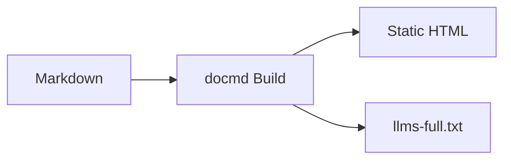

```text
   _                 _ 
 _| |___ ___ _____ _| |
| . | . |  _|     | . |
|___|___|___|_|_|_|___|
```

**Generate beautiful, lightweight documentation sites directly from your Markdown files. Zero clutter, just content.**

`docmd` bridges the gap between simple static site generators and heavy, framework-driven applications. It processes standard Markdown into highly optimized static HTML, while delivering a buttery-smooth Single Page Application (SPA) experience for your users.

::: button "Quick Start" /getting-started/installation
::: button "GitHub" external:https://github.com/docmd-io/docmd color:#333
::: button "Explore Features" /getting-started/basic-usage color:#333

## Quick Start

**Requires [Node.js](https://nodejs.org/) installed on your machine.**

Deploy a beautiful, searchable documentation site in seconds. No framework knowledge required.

**1. Install `docmd` as dependency in your project to lock your versions.**
```bash
npm install @docmd/core     # Install locally (Recommended)

npx @docmd/core init              # Initialize your configuration
npx @docmd/core dev               # Start developing
```

**2. Install Globally**
```bash
npm install -g @docmd/core  # Enables docmd to run anywhere on your local machine
```

**3. You can run `docmd` on-the-fly without installing it or setting up any config.**
```bash
npx @docmd/core dev -z      # Start local dev server instantly
```

Open `http://localhost:3000` in your browser. Any changes you make to the files in the `docs/` folder will instantly update on your screen.

## Why choose docmd?

We believe writing documentation should be as frictionless as possible. You shouldn't need to configure complex JavaScript frameworks just to publish text. We also believe that modern tools should be built for **both humans and machines**. That's why `docmd` is arguably the most AI-friendly static documentation generator on the market, ready to be immediately digested by the newest wave of LLMs directly out of the box.

<div class="image-gallery" style="grid-template-columns: repeat(auto-fit, minmax(300px, 1fr));">

::: card AI-Native Optimization
`docmd` transforms your documentation into a structured API for LLMs, allowing them to ingest your entire project context perfectly in single-shot prompts.
:::

::: card Zero Config & Auto-Routing
Run `docmd dev -z` in your project. We automatically scan for a expected documentation folders, extract H1 headers as page titles, and build a nested, collapsible navigation tree instantly. No `config.js` needed to start.
:::

::: card SPA Performance
We serve static HTML for maximum SEO and speed. Once loaded, `docmd` transitions between pages as a high-performance Single Page Application, no full browser reloads, just instant content swaps.
:::

::: card Smart Offline Search
Built-in full-text search with fuzzy matching and section-deep linking. The entire search index runs in-browser, meaning it works 100% offline and in air-gapped environments.
:::

::: card Modern & Responsive
Responsive by design. Includes a beautiful default theme with native Light/Dark mode, sticky versioning, and mobile-optimized sidebars out of the box.
:::

::: card Isomorphic Rendering
The same engine that builds your static site can run natively in the browser. Embed live documentation previews or interactive editors directly into your own web applications.
:::

</div>

## Rich Content Out of the Box

`docmd` supports standard Markdown and extends it with intuitive components for professional structure.

::: tabs

== tab "Interactive Components"
Highlight critical information with Callouts and native Buttons.

::: callout tip Performance Tip
Nest containers inside each other to create complex, usable layouts without touching HTML or CSS.
:::

::: button "Read about Containers" /content/containers/callouts

== tab "Native Diagrams"
Create professional diagrams using **Mermaid.js** syntax directly in your markdown.



== tab "Code Precision"
Automatic syntax highlighting with `highlight.js`, including one-click copy buttons and multi-language support.

```javascript
// docmd.config.js
export default defineConfig({
  title: 'My Project',
  layout: { spa: true }
});
```

:::

Ready to build? [Install docmd](/getting-started/installation) or see [Zero-Config Mode](/getting-started/zero-config) in action.