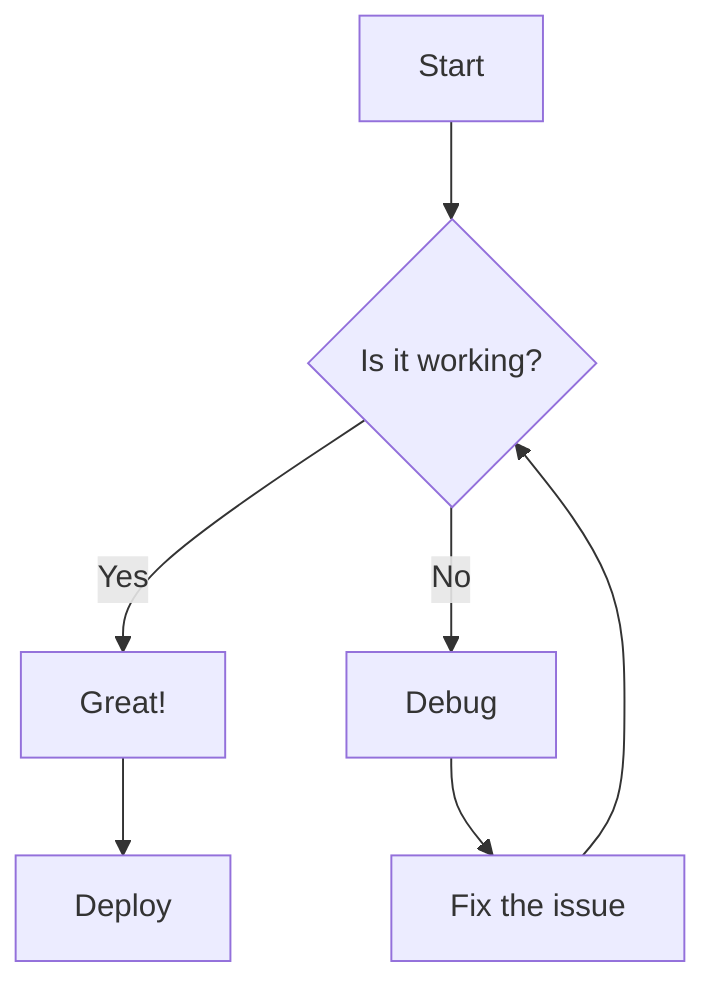
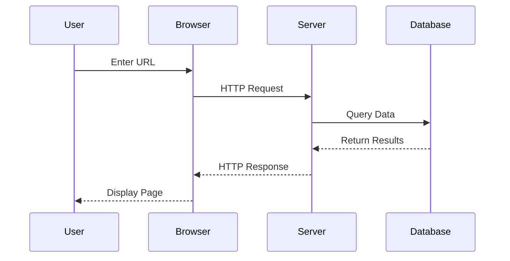
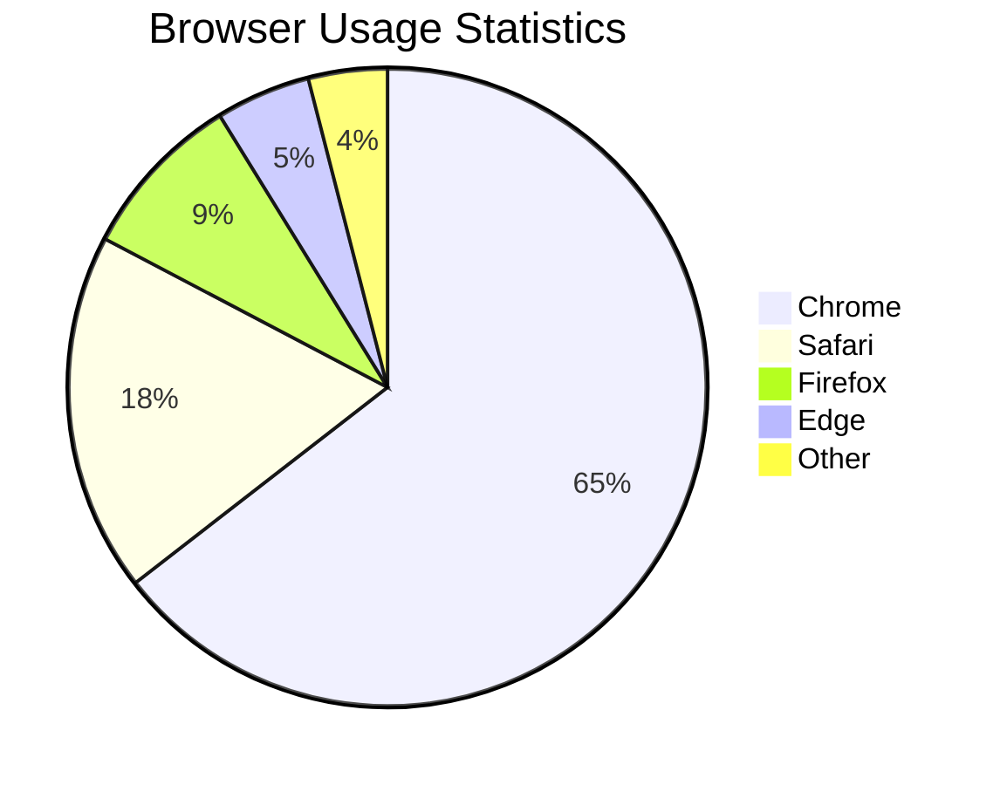
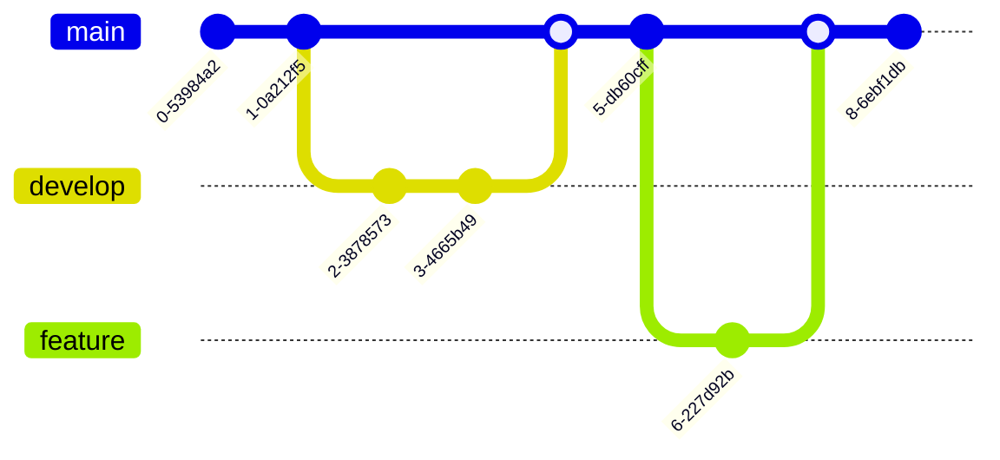
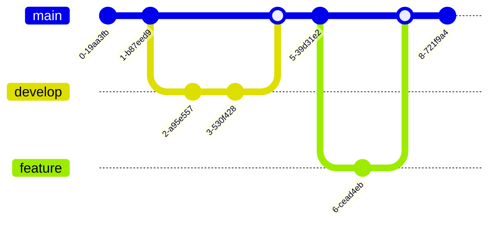
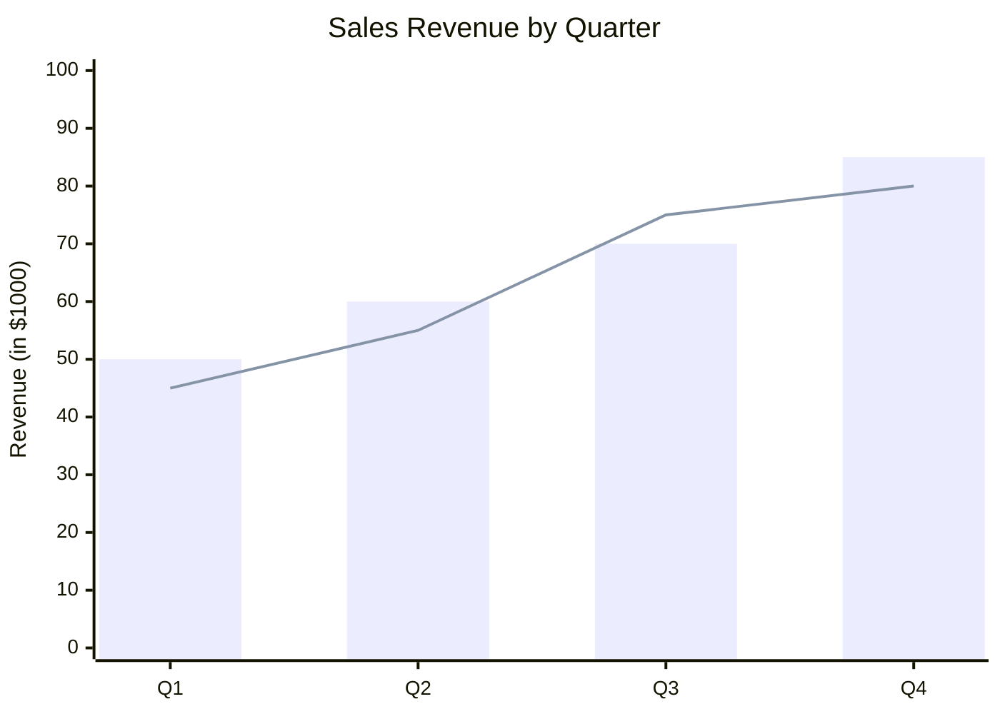

`docmd` includes native, zero-config support for [Mermaid.js](https://mermaid.js.org/). You can create professional diagrams using simple text-based syntax without leaving your Markdown file.

## Why use Mermaid in docmd?

*   **Zero Scripting**: No need to include external scripts. `docmd` detects the usage and injects the rendering engine automatically.
*   **Theme Aware**: Diagrams automatically shift colors between **Light** and **Dark** modes to match your site's theme.
*   **Lazy Loading**: For optimum page speed, diagrams are only initialized once they enter the viewport.

## Examples

### Flowchart

Flowcharts are used to represent workflows or processes. They show the steps as boxes of various kinds, and their order by connecting them with arrows.

````markdown

````


### Sequence Diagram

Sequence diagrams show how processes operate with one another and in what order. They capture the interaction between objects in the context of a collaboration.

````markdown

````


## Pie Chart

Pie charts are circular statistical graphics divided into slices to illustrate numerical proportions.

````markdown

````


## Git Graph

Git graphs visualize Git branching and merging operations, making it easier to understand version control workflows.

````markdown

````



## XY Chart

XY charts display data as a series of points on a coordinate plane, useful for showing correlations and trends.

**Code:**

````markdown

````


::: callout tip
Mermaid diagrams are highly readable by LLMs. When an AI model reads your `llms-full.txt`, it can "see" the logic flow of your diagrams as text, making it much better at explaining complex architectural relationships in your project.
:::