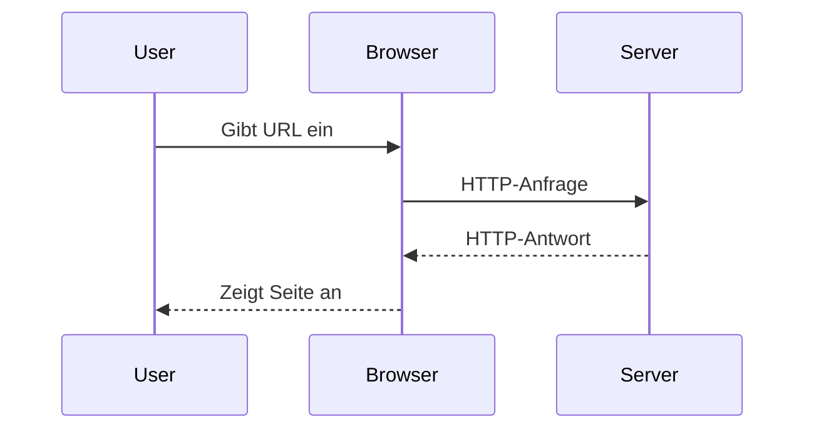
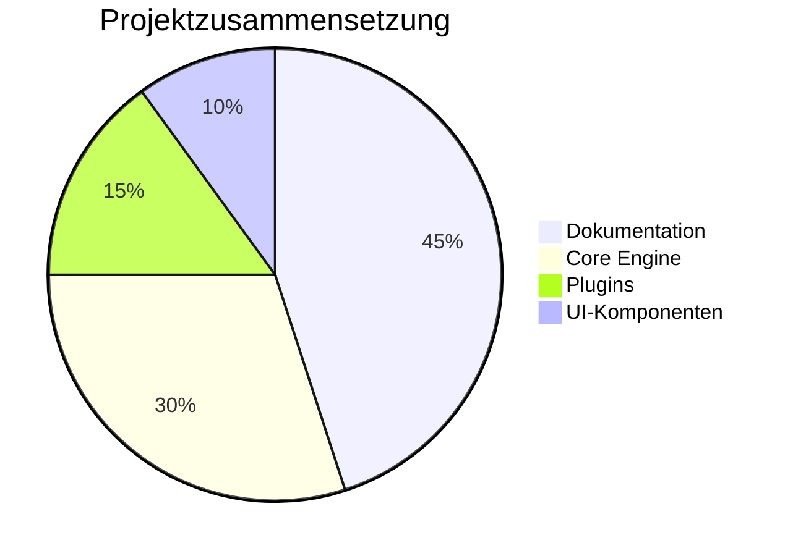
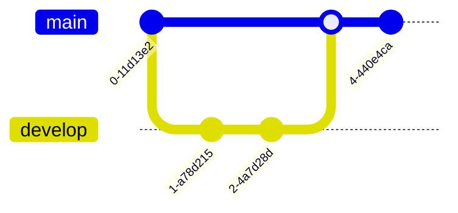

```mermaid
architecture-beta
    group api(icon:cloud)[API]
    service db(icon:database)[Datenbank] in api
    service disk(icon:hard-drive)[Speicher] in api
    db:L -- R:disk
```

Das `@docmd/plugin-mermaid`-Plugin integriert die leistungsstarke [Mermaid.js](external:https://mermaid.js.org/)-Engine in Ihre Dokumentations-Pipeline. Es ermöglicht Ihnen, reine Textbeschreibungen in hochauflösende, interaktive Diagramme zu verwandeln, ohne jemals Ihre Markdown-Umgebung verlassen zu müssen.

## Hauptmerkmale

- **Zero Scripting**: Es ist nicht erforderlich, externe Skripte oder CDN-Links manuell einzubinden. `docmd` erkennt die Verwendung und injiziert die Rendering-Engine nur dort, wo sie benötigt wird.
- **Theme-Bewusstsein**: Diagramme passen ihre Farbschemata automatisch an den Wechsel zwischen **Light**- und **Dark**-Mode Ihrer Website an.
- **Isomorphes Lazy Loading**: Für optimale Performance werden Diagramme erst initialisiert und gerendert, wenn sie in das Sichtfeld des Benutzers gelangen.
- **Interaktive Steuerung**: Jedes Diagramm verfügt über integrierte Funktionen für **Pan** (Schwenken), **Zoom** und **Vollbild**, um sicherzustellen, dass auch große Architekturdiagramme auf allen Bildschirmgrößen lesbar bleiben.
- **Icon-Integration**: Umfassende Unterstützung für das Icon-Paket, sodass Sie die Syntax `icon:name` innerhalb von Architekturdiagrammen verwenden können.
- **Technische Lesbarkeit**: Diagramme bleiben in Ihrem Quellcode reiner Text, was sie leicht versionierbar und für KI-Agenten lesbar macht.

## Konfiguration

Um die Diagramm-Unterstützung zu aktivieren, fügen Sie das `mermaid`-Plugin zu Ihrer `docmd.config.js` hinzu:

```javascript
import { defineConfig } from '@docmd/core';

export default defineConfig({
  plugins: {
    mermaid: {} // Aktiviert mit Zero-Config
  }
});
```

## Implementierungsgalerie

Um ein Diagramm zu rendern, platzieren Sie Ihre Mermaid-Syntax in einem Fenced Code Block mit der Sprachkennung `mermaid`.

### 1. Sequenzdiagramme
Ideal zur Veranschaulichung von Interaktionen zwischen mehreren Systemkomponenten.

::: tabs

== tab "Vorschau"


== tab "Markdown-Quelle"
````markdown

````

:::

### 2. Analytische Diagramme
Visualisieren Sie Daten mit integrierten Diagrammtypen wie Torten- oder Balkendiagrammen.

::: tabs

== tab "Vorschau"


== tab "Markdown-Quelle"
````markdown

````

:::

### 3. Git-Workflows
Visualisieren Sie Branching- und Merging-Strategien für Ihre Entwickler-Leitfäden.

::: tabs

== tab "Vorschau"


== tab "Markdown-Quelle"
````markdown

````

:::

### 4. Architektur & Icons
Verwenden Sie das integrierte **Lucide**-Icon-Paket, um detailreiche Architekturdiagramme zu erstellen, die zum visuellen Stil Ihrer Website passen.

::: tabs

== tab "Vorschau"


== tab "Markdown-Quelle"
````markdown

````

:::

## Technische Implementierung

Das Mermaid-Plugin fängt `mermaid`-Codeblöcke während der Parsing-Phase ab und hüllt sie in einen speziellen `<div class="mermaid">`-Container.

1. **Erkennung**: Die Engine scannt das gerenderte HTML nach dem Vorhandensein von Mermaid-Containern.
2. **Asset-Injektion**: Wenn Container gefunden werden, injiziert `docmd` ein leichtgewichtiges `init-mermaid.js`-Modul.
3. **Rendering**: Die Mermaid-Bibliothek wird asynchron geladen und rendert die Diagramme clientseitig. So bleibt Ihr initiales HTML-Paket klein und schnell.

::: callout tip "Diagramme für KI-Agenten"
Während Diagramme für Menschen visuell hilfreich sind, sind sie für KIs technisch transparent. Da die Quelle reiner Text ist, können Modelle wie GPT-4 oder Claude Ihre Systemarchitektur oder Logikflüsse über den `llms-full.txt`-Stream "sehen". Dies ermöglicht es der KI, komplexe architektonische Beziehungen basierend auf Ihren Diagrammen zu erklären.
:::