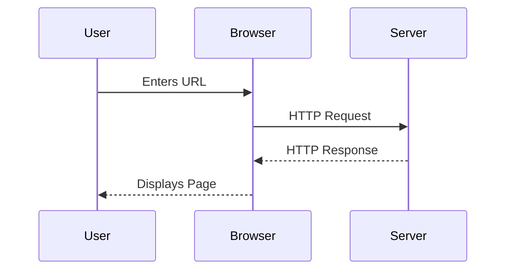
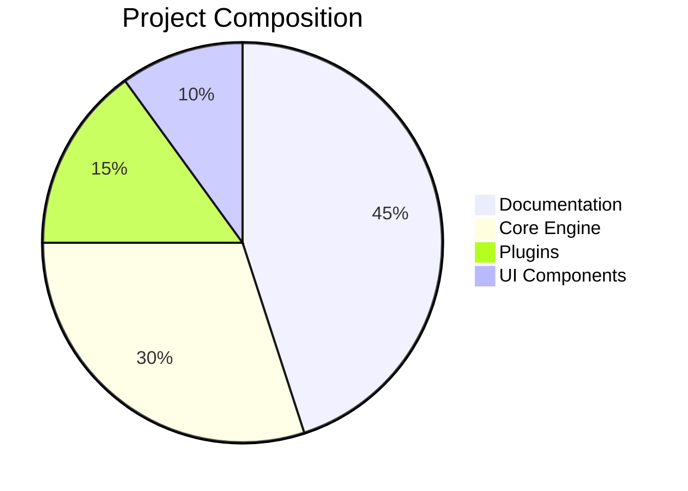
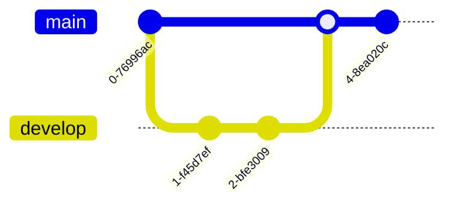
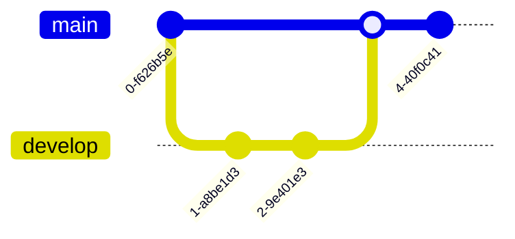

```mermaid
architecture-beta
    group api(icon:cloud)[API]
    service db(icon:database)[Database] in api
    service disk(icon:hard-drive)[Storage] in api
    db:L -- R:disk
```

The `@docmd/plugin-mermaid` plugin integrates the powerful [Mermaid.js](external:https://mermaid.js.org/) engine into your documentation pipeline. It allows you to transform plain-text descriptions into high-fidelity, interactive diagrams without ever leaving your Markdown environment.

## Key Features

- **Zero Scripting**: No need to manually include external scripts or CDN links. `docmd` detects the usage and injects the rendering engine only where needed.
- **Theme Awareness**: Diagrams automatically adapt their color schemes to match your site's **Light** or **Dark** mode transitions.
- **Isomorphic Lazy Loading**: For optimum performance, diagrams are initialised and rendered only as they enter the user's viewport.
- **Interactive Controls**: Every diagram includes built-in **Pan**, **Zoom**, and **Fullscreen** capabilities, ensuring large architectural charts remain legible on all screen sizes.
- **Icon Integration**: Deep support for the icon pack, allowing you to use `icon:name` syntax within architecture diagrams.
- **Technical Readability**: Diagrams remain pure text in your source, making them easily version-controlled and readable by AI agents.

## Configuration

To enable diagram support, add the `mermaid` plugin to your `docmd.config.js`:

```javascript
import { defineConfig } from '@docmd/core';

export default defineConfig({
  plugins: {
    mermaid: {} // Enabled with zero-config
  }
});
```

## Implementation Gallery

To render a diagram, place your Mermaid syntax within a fenced code block with the `mermaid` language identifier.

### 1. Sequence Diagrams
Ideal for illustrating interactions between multiple system components.

::: tabs

== tab "Preview"


== tab "Markdown Source"
````markdown

````

:::

### 2. Analytical Charts
Visualize data using built-in chart types like Pie Charts or Bar Charts.

::: tabs

== tab "Preview"


== tab "Markdown Source"
````markdown

````

:::

### 3. Git Workflows
Visualize branching and merging strategies for your developer guides.

::: tabs

== tab "Preview"


== tab "Markdown Source"
````markdown

````

:::

### 4. Architecture & Icons
Use the integrated **Lucide** icon pack to create rich architectural diagrams that match your site's visual style.

::: tabs

== tab "Preview"


== tab "Markdown Source"
````markdown

````

:::

## Technical Implementation

The Mermaid plugin operates by intercepting `mermaid` code blocks during the parsing phase and wrapping them in a specialised `<div class="mermaid">` container. 

1. **Detection**: The engine scans the rendered HTML for the presence of mermaid containers.
2. **Asset Injection**: If containers are found, `docmd` injects a lightweight `init-mermaid.js` module.
3. **Rendering**: The Mermaid library is fetched asynchronously and renders the diagrams client-side, ensuring that your initial HTML payload remains small and fast.

::: callout tip "Diagrams for AI Agents"
While diagrams are visually helpful for humans, they are technically transparent to AI. Because the source is pure text, models like GPT-4 or Claude can "see" your system architecture or logic flows through the `llms-full.txt` stream. This allows the AI to explain complex architectural relationships based on your diagrams.
:::