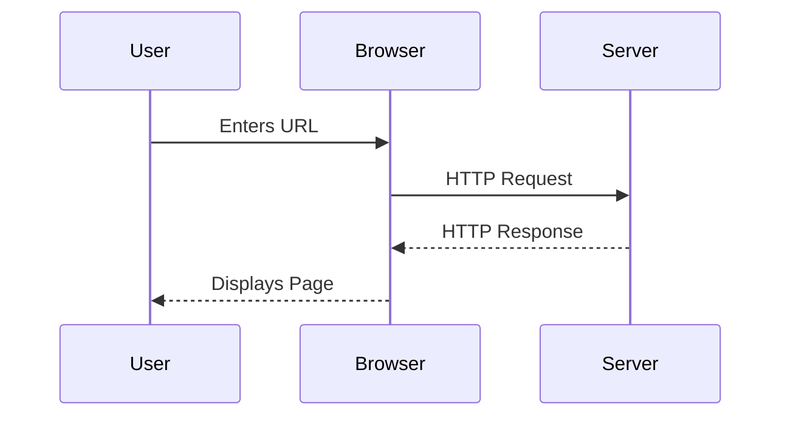

The `@docmd/plugin-mermaid` plugin integrates the powerful [Mermaid.js](external:https://mermaid.js.org/) engine into your documentation pipeline. It allows you to transform plain-text descriptions into high-fidelity, interactive diagrams with built-in support for themes, panning, and zooming.

## Configuration

The Mermaid plugin is bundled with `@docmd/core` and enabled by default. No mandatory configuration is required.

| Option | Type | Default | Description |
| :--- | :--- | :--- | :--- |
| `enabled` | `boolean` | `true` | Enable or disable Mermaid diagram rendering globally. |

### Example

```javascript
import { defineConfig } from '@docmd/core';

export default defineConfig({
  plugins: {
    mermaid: {} // Enabled by default
  }
});
```

## Features

- **Theme Awareness**: Diagrams automatically adapt to **Light** or **Dark** mode transitions.
- **Interactive Controls**: Built-in **Pan**, **Zoom**, and **Fullscreen** buttons for every diagram.
- **Lazy Loading**: Diagrams are initialised only as they enter the user's viewport for optimum performance.
- **Icon Support**: Deep integration with the **Lucide** icon pack (use `icon:name` syntax).

## Usage

Embed diagrams using a fenced code block with the `mermaid` language identifier.

### Sequence Diagram Example

::: tabs

== tab "Preview"


== tab "Source"
````markdown

````

:::

### Architecture Example

```mermaid
architecture-beta
    group api(icon:cloud)[API Service]
    service db(icon:database)[Database] in api
    service disk(icon:hard-drive)[Storage] in api
    db:L -- R:disk
```



::: callout tip "AI Readability"
Because Mermaid diagrams are defined as pure text in your Markdown, they are fully readable by AI agents. This allows LLMs to understand and explain your system architecture directly from your documentation source.
:::