The `docmd` 0.7.4 release introduces a powerful new feature to our offline search plugin: **Context-Aware Version Filtering**. It also includes a hotfix for Mermaid icon rendering and syntax standardization.

## ✨ Highlights

### 🔍 Version Filtering in Search

When building documentation with multiple versions, finding the right information can be challenging. The built-in search modal now natively understands version silos and automatically generates a dynamic filter bar.

- **Smart Version Detection**: The search engine automatically extracts all available versions from your index and generates clickable filter tags.
- **Color-Coded Tags**: Each version tag is automatically assigned a unique, aesthetically pleasing color from a predefined palette to help users visually distinguish between different documentation silos.
- **Real-Time Toggling**: Users can click tags to instantly narrow down their search results to one or multiple specific versions, providing a much cleaner and more accurate search experience.

### 🏷️ Inline Tags Container

We've introduced a brand new `tag` container! This is a self-closing, inline component designed for inserting pill-shaped badges directly into your text or headings. 

- **Fully Customisable**: Override default colors with any CSS color string (`color:#ef4444`).
- **Icon Support**: Attach any Lucide icon (`icon:check-circle`) directly to the tag.
- **Hyperlinks**: Seamlessly turn tags into links using the `link:` attribute.
- **Heading-Safe**: Tags automatically align to the baseline without inheriting massive font sizes when used inside `<h1>` or `<h2>` elements.

## 🐛 Bug Fixes

- **Mermaid Icon Registration**: Fixed an issue where the Lucide icon pack was not properly decoupled from the user-facing syntax in Mermaid flowcharts.
- **Architecture Syntax Support**: We have officially migrated our documented Mermaid icon support to use Mermaid's native `architecture` and `architecture-beta` diagram types, which support inline Iconify nodes perfectly.

## 🛡️ Security
- **Dependency Audit**: Addressed multiple security advisories by forcefully upgrading deeply nested sub-dependencies across the monorepo (`cross-spawn`, `dompurify`, `lodash-es`, `uuid`, and `mermaid`). The entire engine ecosystem is now 100% clean and vulnerability-free.

## ✨ Standardized Icon Syntax

To abstract the underlying icon library (currently Lucide) from your diagrams, we have registered the pack generically as `icon`.

This means that instead of explicitly tying your documentation to `lucide:`, you should now use `icon:`. This future-proofs your diagrams—if we ever expand or change the underlying icon library in `docmd`, your diagrams will automatically inherit the updates without any changes required on your end!

**Example:**

```mermaid
architecture-beta
    group api(icon:cloud)[API]
    service db(icon:database)[Database] in api
    service disk(icon:hard-drive)[Storage] in api
    db:L -- R:disk
```

## Migration Guide

For **end users**: Update to the latest patch with `npm update @docmd/core`. 

If you previously used `lucide:` in your Mermaid diagrams, please replace it with the new `icon:` prefix.