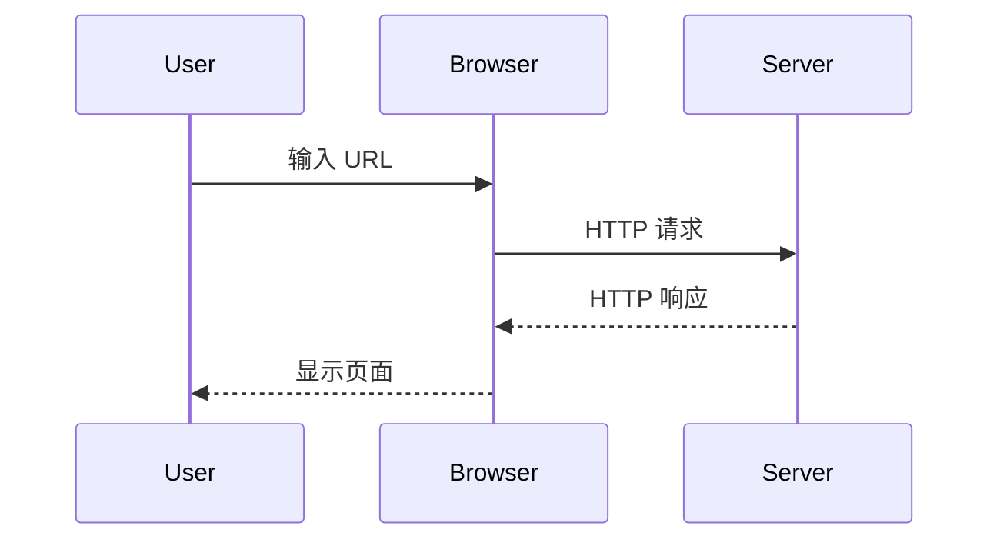
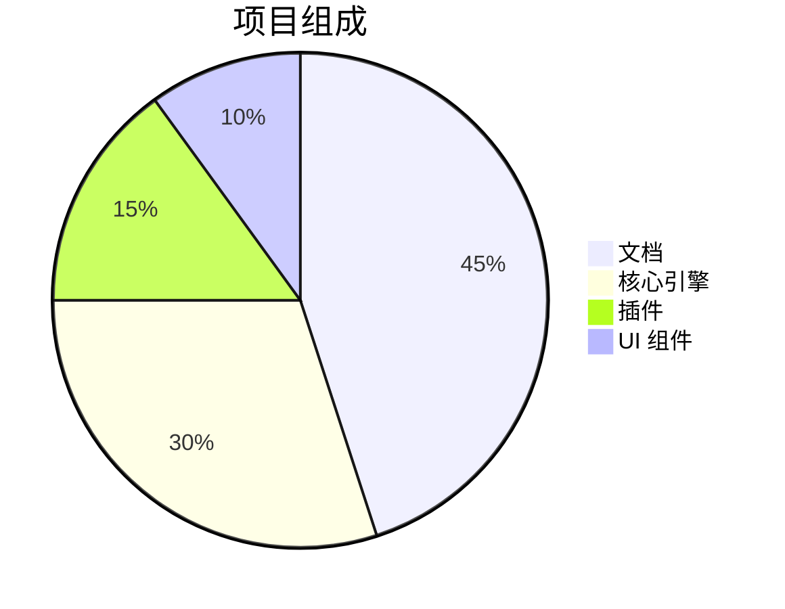
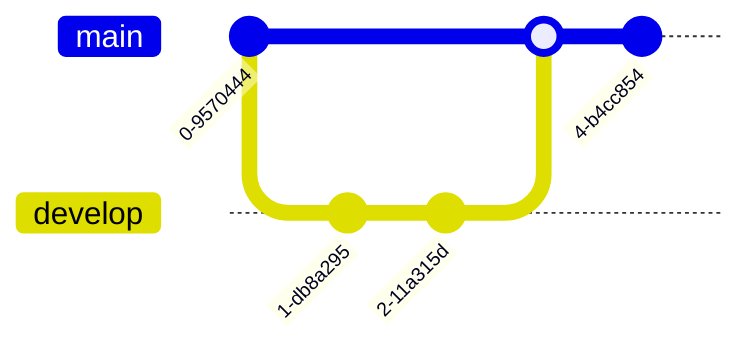

`@docmd/plugin-mermaid` 插件将强大的 [Mermaid.js](external:https://mermaid.js.org/) 引擎集成到你的文档流水线中。它允许你将纯文本描述转换为高保真、交互式的图表，而无需离开 Markdown 环境。

## 主要特性

- **零脚本**: 无需手动引入外部脚本或 CDN 链接。`docmd` 会检测使用情况，并仅在需要的地方注入渲染引擎。
- **主题感知**: 图表会自动调整其配色方案，以匹配网站的 **浅色** 或 **深色** 模式切换。
- **同构延迟加载**: 为了获得最佳性能，图表仅在进入用户视口时才进行初始化和渲染。
- **交互控制**: 每个图表都内置了 **平移 (Pan)**、**缩放 (Zoom)** 和 **全屏 (Fullscreen)** 功能，确保大型架构图在所有屏幕尺寸上都清晰可见。
- **图标集成**: 深度支持图标库，允许你在架构图中使用 `icon:name` 语法。
- **技术可读性**: 图表在源码中保持纯文本形式，使其易于进行版本控制，并且可被 AI 代理阅读。

## 配置

要启用图表支持，请在 `docmd.config.js` 中添加 `mermaid` 插件：

```javascript
import { defineConfig } from '@docmd/core';

export default defineConfig({
  plugins: {
    mermaid: {} // 零配置启用
  }
});
```

## 实现展示

要渲染图表，请将你的 Mermaid 语法放置在带有 `mermaid` 语言标识符的围栏代码块内。

### 1. 序列图 (Sequence Diagrams)
非常适合说明多个系统组件之间的交互。

::: tabs

== tab "预览"


== tab "Markdown 源码"
````markdown

````

:::

### 2. 分析图表
使用内置的图表类型（如饼图或柱状图）将数据可视化。

::: tabs

== tab "预览"


== tab "Markdown 源码"
````markdown

````

:::

### 3. Git 工作流
为你的开发者指南可视化分支和合并策略。

::: tabs

== tab "预览"


== tab "Markdown 源码"
````markdown

````

:::

### 4. 架构与图标
使用集成的 **Lucide** 图标库创建与网站视觉风格匹配的丰富架构图。

::: tabs

== tab "预览"


== tab "Markdown 源码"
````markdown

````

:::

## 技术实现

Mermaid 插件通过在解析阶段拦截 `mermaid` 代码块并将其包裹在专门的 `<div class="mermaid">` 容器中来运行。

1. **检测**: 引擎扫描渲染后的 HTML 以查找 mermaid 容器的存在。
2. **资源注入**: 如果发现容器，`docmd` 会注入一个轻量级的 `init-mermaid.js` 模块。
3. **渲染**: Mermaid 库会被异步获取，并在客户端渲染图表，确保你的初始 HTML 负载保持小巧且快速。

::: callout tip "针对 AI 代理的图表"
虽然图表在视觉上对人类有帮助，但它们在技术上对 AI 也是透明的。因为源码是纯文本，像 GPT-4 或 Claude 这样的模型可以通过 `llms-full.txt` 流“看到”你的系统架构或逻辑流。这允许 AI 根据你的图表解释复杂的架构关系。
:::