`docmd` 0.7.4 版本为我们的离线搜索插件引入了一项强大的新功能：**上下文感知的版本过滤**。此版本还包含针对 Mermaid 图标渲染和语法标准化的热修复。

## ✨ 亮点

### 🔍 搜索中的版本过滤

在构建包含多个版本的文档时，查找正确的信息可能具有挑战性。内置的搜索模态框现在原生理解版本隔离，并自动生成动态过滤栏。

- **智能版本检测**：搜索引擎会自动从您的索引中提取所有可用版本，并生成可点击的过滤标签。
- **彩色编码标签**：系统会自动从预定义调色板中为每个版本标签分配独特、美观的颜色，帮助用户在视觉上区分不同的文档版本。
- **实时切换**：用户可以点击标签，立即将搜索结果缩小到一个或多个特定版本，从而提供更清晰、更准确的搜索体验。

### 🏷️ 内联标签容器

我们引入了全新的 `tag`（标签）容器！这是一个自闭合的内联组件，专为在文本或标题中直接插入药丸状徽章而设计。

- **完全可自定义**：可以使用任何 CSS 颜色字符串（如 `color:#ef4444`）覆盖默认颜色。
- **图标支持**：支持直接将任何 Lucide 图标（如 `icon:check-circle`）附加到标签上。
- **超链接**：使用 `link:` 属性将标签无缝转换为链接。
- **兼容标题**：在 `<h1>` 或 `<h2>` 元素中使用时，标签会自动与基线对齐，而不会继承巨大的字体大小。

## 🐛 问题修复

- **Mermaid 图标注册**：修复了在 Mermaid 流程图中，Lucide 图标库未能与用户使用的语法正确解耦的问题。
- **架构图语法支持**：我们已正式将 Mermaid 图标支持的文档迁移至使用 Mermaid 原生的 `architecture` 和 `architecture-beta` 图表类型，这些类型原生完美支持内联 Iconify 图标节点。

## 🛡️ 安全更新
- **依赖审计**：通过在整个 monorepo 中强制升级深层嵌套的子依赖（`cross-spawn`、`dompurify`、`lodash-es`、`uuid` 和 `mermaid`），解决了多个安全警告。整个引擎生态系统现在 100% 干净且无漏洞。

## ✨ 标准化的图标语法

为了在图表中抽象底层的图标库（目前为 Lucide），我们将图标包统一注册为 `icon`。

这意味着，您现在应该使用 `icon:` 而不是将文档显式绑定到 `lucide:`。这能为您的图表提供面向未来的保障——如果我们将来在 `docmd` 中扩展或更改了底层图标库，您的图表将自动继承这些更新，而无需您进行任何修改！

**示例：**

```mermaid
architecture-beta
    group api(icon:cloud)[API]
    service db(icon:database)[Database] in api
    service disk(icon:hard-drive)[Storage] in api
    db:L -- R:disk
```

## 迁移指南

对于**最终用户**：使用 `npm update @docmd/core` 更新到最新的补丁版本。

如果您之前在 Mermaid 图表中使用了 `lucide:`，请将其替换为新的 `icon:` 前缀。
