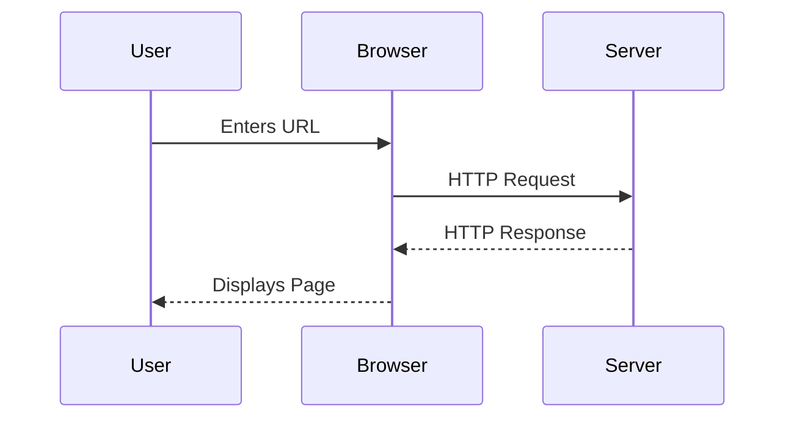

Das `@docmd/plugin-mermaid`-Plugin integriert [Mermaid.js](external:https://mermaid.js.org/) in die Build-Pipeline. Klartext-Beschreibungen werden zu interaktiven Diagrammen mit Theme-Unterstützung, Schwenken und Zoomen.

## Konfiguration

Das Plugin wird mit `@docmd/core` gebündelt und ist standardmäßig aktiviert.

| Option | Typ | Standard | Beschreibung |
| :--- | :--- | :--- | :--- |
| `enabled` | `boolean` | `true` | Mermaid-Rendering global aktivieren oder deaktivieren. |

### Beispiel

```json "docmd.config.json"
{
  "plugins": {
    "mermaid": {}
  }
}
```

## Funktionen

- **Theme-bewusst**: Diagramme passen sich automatisch dem Hell- oder Dunkelmodus an.
- **Interaktiv**: eingebaute Schwenk-, Zoom- und Vollbild-Steuerelemente pro Diagramm.
- **Lazy-Initialisierung**: Skripte werden nur geladen und gerendert, wenn ein Diagramm in den Viewport eintritt.
- **Icon-Pack**: unterstützt die `icon:name`-Syntax, unterstützt durch den Lucide-Icon-Satz.

## Verwendung

Betten Sie Diagramme mit einem umzäunten Codeblock und dem `mermaid`-Sprachbezeichner ein.

### Sequenzdiagramm-Beispiel

::: tabs

== tab "Vorschau"


== tab "Quelle"
````markdown

````

:::

### Architektur-Beispiel

```mermaid
architecture-beta
    group api(icon:cloud)[API Service]
    service db(icon:database)[Database] in api
    service disk(icon:hard-drive)[Storage] in api
    db:L -- R:disk
```



::: callout tip "KI-Lesbarkeit"
Da Mermaid-Diagramme als reiner Text in Ihrem Markdown definiert sind, sind sie für KI-Agenten vollständig lesbar. Dies ermöglicht es LLMs, Ihre Systemarchitektur direkt aus Ihrer Dokumentationsquelle zu verstehen und zu erklären.
:::