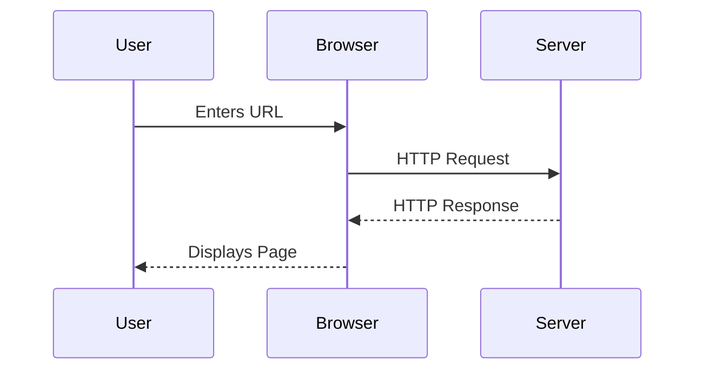

The `@docmd/plugin-mermaid` plugin integrates [Mermaid.js](external:https://mermaid.js.org/) into the build pipeline. Plain-text descriptions become interactive diagrams with theme support, panning, and zooming.

## Configuration

The plugin is bundled with `@docmd/core` and enabled by default.

| Option | Type | Default | Description |
| :--- | :--- | :--- | :--- |
| `enabled` | `boolean` | `true` | Enable or disable Mermaid rendering globally. |

### Example

```json
{
  "plugins": {
    "mermaid": {}
  }
}
```

## Features

- **Theme aware**: diagrams adapt to light or dark mode automatically.
- **Interactive**: built-in pan, zoom, and fullscreen controls per diagram.
- **Lazy initialisation**: scripts load and render only as a diagram enters the viewport.
- **Icon pack**: supports `icon:name` syntax backed by the Lucide icon set.

## Usage

Embed diagrams using a fenced code block with the `mermaid` language identifier.

### Sequence Diagram Example

::: tabs

== tab "Preview"


== tab "Source"
````markdown

````

:::

### Architecture Example

```mermaid
architecture-beta
    group api(icon:cloud)[API Service]
    service db(icon:database)[Database] in api
    service disk(icon:hard-drive)[Storage] in api
    db:L -- R:disk
```



::: callout tip "AI Readability"
Because Mermaid diagrams are defined as pure text in your Markdown, they are fully readable by AI agents. This allows LLMs to understand and explain your system architecture directly from your documentation source.
:::