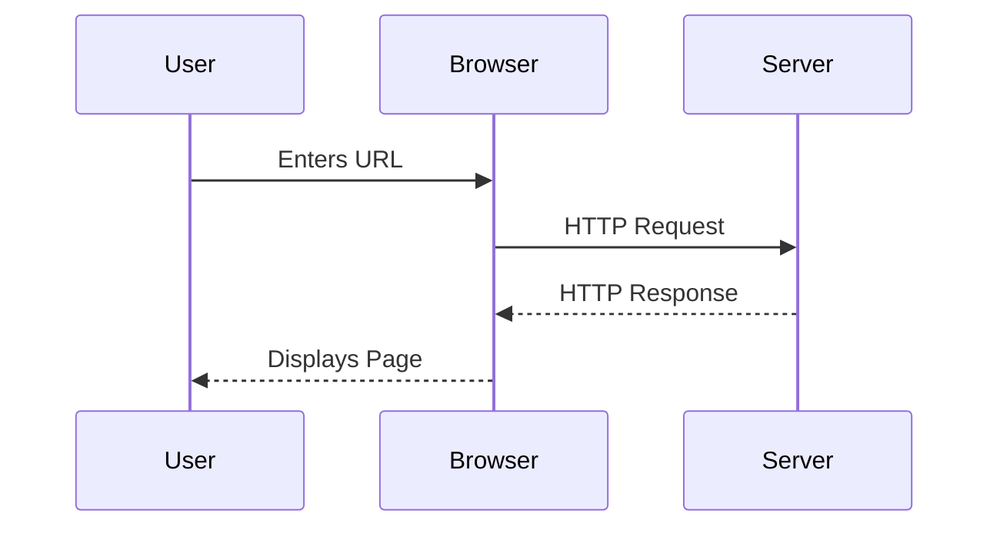

`@docmd/plugin-mermaid` 插件将 [Mermaid.js](external:https://mermaid.js.org/) 集成到构建管线中。纯文本描述会变成具有主题支持、平移和缩放的交互式图表。

## 配置

该插件与 `@docmd/core` 捆绑，默认启用。

| 选项 | 类型 | 默认值 | 说明 |
| :--- | :--- | :--- | :--- |
| `enabled` | `boolean` | `true` | 全局启用或禁用 Mermaid 渲染。 |

### 示例

```json "docmd.config.json"
{
  "plugins": {
    "mermaid": {}
  }
}
```

## 功能

- **主题感知**：图表自动适应亮色或暗色模式。
- **交互式**：每个图表内置平移、缩放和全屏控件。
- **惰性初始化**：脚本仅在图表进入视口时才会加载和渲染。
- **图标包**：支持由 Lucide 图标集支持的 `icon:name` 语法。

## 用法

使用带有 `mermaid` 语言标识符的围栏代码块嵌入图表。

### 序列图示例

::: tabs

== tab "预览"


== tab "源码"
````markdown

````

:::

### 架构示例

```mermaid
architecture-beta
    group api(icon:cloud)[API Service]
    service db(icon:database)[Database] in api
    service disk(icon:hard-drive)[Storage] in api
    db:L -- R:disk
```



::: callout tip "AI 可读性"
由于 Mermaid 图表在 Markdown 中以纯文本形式定义，它们可以被 AI 智能体完整阅读。这使得 LLM 可以直接从您的文档源理解并解释您的系统架构。
:::
