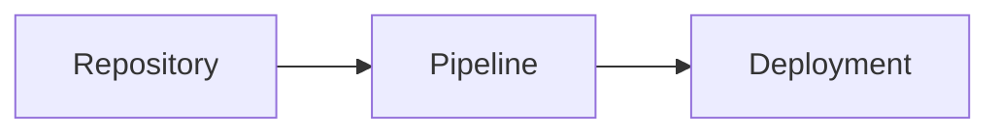

`docmd` bietet integrierte Unterstützung zum Rendern hochauflösender Diagramme über **Mermaid**. Autoren können zwischen individuellen Anpassungen pro Diagramm mit dem `::: mermaid` Container oder universeller Kompatibilität mit Standard-Markdown-Codeblöcken wählen.

::: callout info "v0.9.1+ Standardisierung der Container-Syntax" icon:sparkles
Ab **v0.9.1** führt `docmd` explizite Öffnungs- und Schließungs-Container-Tags (z.B. `::: mermaid` ... `::: /mermaid`), explizite Key-Value-Eigenschaften (`title:"..."`, `align:center`) und nachfolgende `# Kommentare` ein. Diese modernisierte Syntax wird für alle neuen Dokumentationen empfohlen. Die vollständige Abwärtskompatibilität für Standard-` ```mermaid ` Codeblöcke und globale Plugin-Konfigurationen bleibt strikt erhalten.
:::

## Übersicht & Hybride Architektur

`docmd` unterstützt ein hybrides Konzept für das Rendern von Diagrammen:

1. **`::: mermaid` Container-Syntax (Empfohlen für erweiterte UI)**: Ermöglicht Steuerelemente pro Diagramm wie benutzerdefinierte Titel, Icons, Ausrichtung, Zoom-Schalter und Theme-Overrided.
2. **Standard ` ```mermaid ` Codeblock-Syntax (GFM Fallback)**: Behält 100 % Kompatibilität mit GitHub, IDE-Vorschauen und Standard-Markdown-Parsern bei und wendet globale Standardwerte aus der `docmd.config.json` an.

## 1. Container-Syntax (`::: mermaid`)

Der `::: mermaid` Container bietet eine feingranulare Steuerung der einzelnen Diagrammdarstellungen.

### Referenz-Syntax

```markdown
::: mermaid title:"Titeltext" icon:icon_name align:center|left|right zoom:true|false theme:theme_name # optionaler Kommentar
graph TD
    A[Start] --> B[Prozess]
::: /mermaid
```

### Grundlegendes Flussdiagramm mit Titel

```markdown
::: mermaid title:"Anwendungs-Lebenszyklus" icon:refresh-cw align:center # Lebenszyklus Diagramm
graph TD
    A[Init] --> B[Parse Markdown]
    B --> C[Inject Assets]
    C --> D[Render HTML]
::: /mermaid
```

### Sequenzdiagramm mit Steuerelementen

```markdown
::: mermaid title:"OAuth2 Token Flow" icon:shield-check align:center zoom:true # Sequenzablauf
sequenceDiagram
    autonumber
    Client->>AuthServer: POST /token
    AuthServer-->>Client: 200 OK (Access Token)
::: /mermaid
```

### Wichtigste Eigenschaften

| Eigenschaft | Typ | Standard | Beschreibung |
| :--- | :--- | :--- | :--- |
| `title` | `string` | `""` | Optionaler Titel, der über dem Diagramm angezeigt wird. |
| `icon` | `string` | `""` | Optionales Icon neben dem Titel (z. B. `icon:git-branch`). |
| `align` | `string` | `"center"` | Ausrichtung des Containers: `left`, `center` oder `right`. |
| `zoom` | `boolean` | `true` | Aktiviert interaktive Pan- und Zoom-Steuerelemente. |
| `theme` | `string` | `""` | Theme-Override pro Diagramm (`default`, `dark`, `forest`, `neutral`). |

## 2. Standard-Codeblock Fallback (GFM Kompatibilität)

Für universelle Kompatibilität mit Vorschaufenstern auf GitHub und anderen Git-Plattformen verwenden Sie Standard-Codeblöcke:

````markdown

````

Über Codeblöcke gerenderte Diagramme erben automatisch die globalen Einstellungen unter `plugins.mermaid` in der `docmd.config.json`.

## Globale Plugin-Konfiguration

Globale Standardwerte für Codeblöcke und Styling werden in Ihrer Projektkonfiguration festgelegt:

```json
{
  "plugins": {
    "mermaid": {
      "theme": "default",
      "darkTheme": "dark",
      "zoom": true
    }
  }
}
```

Ausführliche Informationen zur Installation und zu Assets finden Sie in der [@docmd/plugin-mermaid Referenz](../../plugins/mermaid.md).