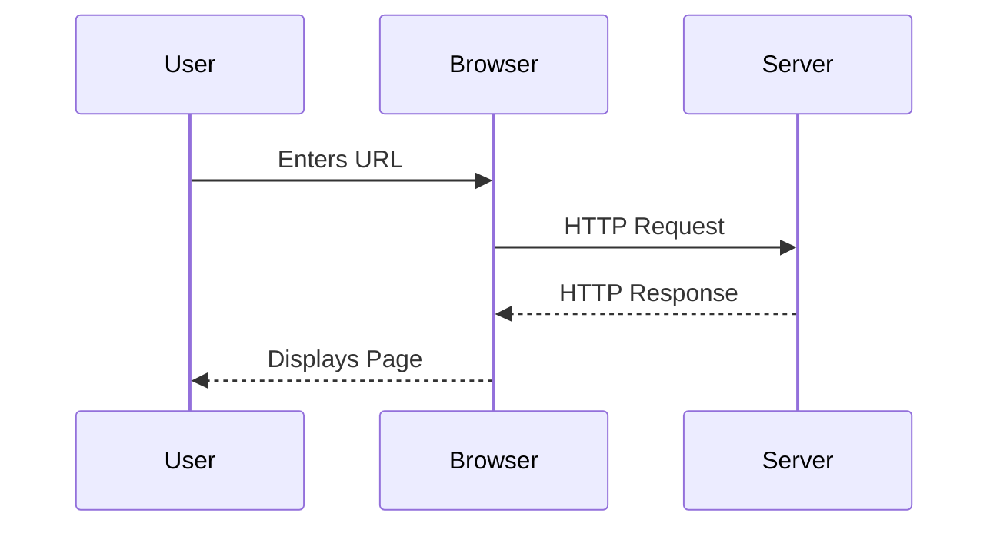

Das `@docmd/plugin-mermaid`-Plugin integriert [Mermaid.js](external:https://mermaid.js.org/) in docmd. Es rendert Diagrammdeklarationen in Klartext in interaktive SVG-Grafiken mit automatischer Themenanpassung, Schwenk- und Zoomfunktionen.

## Konfigurationsoptionen

Konfigurieren Sie Mermaid-Rendering-Optionen in `docmd.config.json`:

| Option | Typ | Standard | Technische Beschreibung |
| :--- | :--- | :--- | :--- |
| `enabled` | `boolean` | `true` | Mermaid-Diagramm-Rendering global aktivieren oder deaktivieren. |

### Globales Konfigurationsbeispiel

```json "docmd.config.json"
{
  "plugins": {
    "mermaid": {
      "enabled": true
    }
  }
}
```

## Hauptfunktionen

* **Erscheinungsbild-Synchronisation**: Diagramm-Farbschemata passen sich dynamisch an die aktiven hellen und dunklen Erscheinungsbildmodi an.
* **Interaktive Zeichenfläche**: Eingebaute Schwenk-, Zoom- und Vollbild-Erweiterungstrigger.
* **Lazy-Initialisierung**: Diagramm-Rendering-Skripte werden nur dann asynchron geladen, wenn das Diagramm den Viewport schneidet.
* **Icon-Integration**: Unterstützt die `icon:name`-Syntax, angetrieben von Lucide-Icons in Knotendefinitionen.

## Verwendung & Syntax

Schreiben Sie Diagramme mit umzäunten Codeblöcken, die mit dem Sprachbezeichner `mermaid` versehen sind.

### Sequenzdiagramm-Beispiel

::: tabs

== tab "Vorschau"


== tab "Quelltext"
````markdown

````

:::

### Architekturdiagramm-Beispiel

```mermaid
architecture-beta
    group api(icon:cloud)[API Service]
    service db(icon:database)[Database] in api
    service disk(icon:hard-drive)[Storage] in api
    db:L -- R:disk
```



::: callout tip "KI-Wissensextraktion" icon:cpu
Da Mermaid-Diagramme in Klartext innerhalb von Markdown-Quelldateien verfasst sind, erfassen KI-Agenten und LLM-Scraper Diagrammstrukturen direkt, ohne dass eine OCR-Bildverarbeitung erforderlich ist.
:::