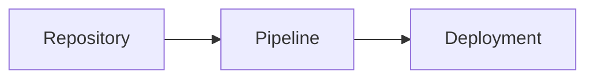

`docmd` provides built-in support for rendering high-fidelity diagrams via **Mermaid**. Authors can choose between per-diagram customisation using the `::: mermaid` container or universal compatibility using standard Markdown code blocks.

::: callout info "v0.9.1+ Container Syntax Standardisation" icon:sparkles
Starting in **v0.9.1**, `docmd` introduces explicit opening and closing container tags (e.g., `::: mermaid` ... `::: /mermaid`), explicit key-value properties (`title:"..."`, `align:center`), and trailing `# comments`. This modernised syntax is recommended for all new documentation. Full backward compatibility for standard ` ```mermaid ` code blocks and global plugin configuration is strictly preserved.
:::

## Overview & Hybrid Architecture

`docmd` supports a hybrid design for diagram rendering:

1. **`::: mermaid` Container Syntax (Recommended for Rich UI)**: Enables per-diagram controls such as custom titles, icons, alignment, zoom toggles, and theme overrides.
2. **Standard ` ```mermaid ` Code Block Syntax (GFM Fallback)**: Maintains 100% compatibility with GitHub, IDE previewers, and standard Markdown parsers while applying global defaults configured in `docmd.config.json`.

## 1. Container Syntax (`::: mermaid`)

The `::: mermaid` container provides granular control over individual diagram presentations.

### Reference Syntax

```markdown
::: mermaid title:"Title text" icon:icon_name align:center|left|right zoom:true|false theme:theme_name # optional comment
graph TD
    A[Start] --> B[Process]
::: /mermaid
```

### Basic Flowchart with Custom Title

```markdown
::: mermaid title:"Application Lifecycle" icon:refresh-cw align:center # Lifecycle diagram
graph TD
    A[Init] --> B[Parse Markdown]
    B --> C[Inject Assets]
    C --> D[Render HTML]
::: /mermaid
```

### Sequence Diagram with Controls

```markdown
::: mermaid title:"OAuth2 Token Flow" icon:shield-check align:center zoom:true # Sequence flow
sequenceDiagram
    autonumber
    Client->>AuthServer: POST /token
    AuthServer-->>Client: 200 OK (Access Token)
::: /mermaid
```

::: mermaid title:"OAuth2 Token Flow" icon:shield-check align:center zoom:true # Sequence flow
sequenceDiagram
    autonumber
    Client->>AuthServer: POST /token
    AuthServer-->>Client: 200 OK (Access Token)
::: /mermaid

### Key Properties

| Property | Type | Default | Description |
| :--- | :--- | :--- | :--- |
| `title` | `string` | `""` | Optional header title displayed above the diagram. |
| `icon` | `string` | `""` | Optional icon rendered next to the title (e.g., `icon:git-branch`). |
| `align` | `string` | `"center"` | Container alignment: `left`, `center`, or `right`. |
| `zoom` | `boolean` | `true` | Enables interactive pan and zoom controls. |
| `theme` | `string` | `""` | Per-diagram theme override (`default`, `dark`, `forest`, `neutral`). |

## 2. Standard Code Block Fallback (GFM Compatibility)

For universal compatibility with GitHub Markdown previewers and standard Git platforms, use standard fenced code blocks:

````markdown

````

Diagrams rendered via code blocks automatically inherit global settings configured under `plugins.mermaid` in `docmd.config.json`.

## Global Plugin Configuration

Global defaults for fallback code blocks and default container styling are set in your project configuration:

```json
{
  "plugins": {
    "mermaid": {
      "theme": "default",
      "darkTheme": "dark",
      "zoom": true
    }
  }
}
```

For full details on plugin installation and bundle assets, see the [@docmd/plugin-mermaid Reference](../../plugins/mermaid.md).