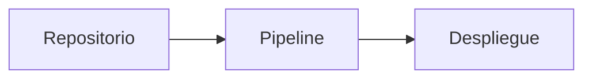

`docmd` incluye soporte integrado para renderizar diagramas de alta fidelidad con **Mermaid**. Los autores pueden elegir entre personalización por diagrama mediante el contenedor `::: mermaid` o compatibilidad universal utilizando bloques de código estándar.

::: callout info "Estandarización de Sintaxis de Contenedores v0.9.1+" icon:sparkles
A partir de **v0.9.1**, `docmd` introduce etiquetas de apertura y cierre explícitas (ej. `::: mermaid` ... `::: /mermaid`), propiedades clave-valor explícitas (`title:"..."`, `align:center`) y comentarios al final `# comentario`. Esta sintaxis modernizada se recomienda para toda nueva documentación. Se mantiene la compatibilidad hacia atrás completa para bloques de código estándar ` ```mermaid ` y configuraciones globales de plugins.
:::

## Visión General y Arquitectura Híbrida

`docmd` admite un diseño híbrido para la representación de diagramas:

1. **Sintaxis de Contenedor `::: mermaid` (Recomendada para UI avanzada)**: Permite controles específicos por diagrama como títulos personalizados, iconos, alineación, botones de zoom y reemplazos de temas.
2. **Sintaxis de Bloque de Código Estándar ` ```mermaid ` (Fallback GFM)**: Mantiene el 100% de compatibilidad con GitHub, previsualizadores de IDE y analizadores Markdown estándar aplicando la configuración global definida en `docmd.config.json`.

## 1. Sintaxis de Contenedor (`::: mermaid`)

El contenedor `::: mermaid` proporciona un control detallado sobre la presentación de cada diagrama.

### Sintaxis de Referencia

```markdown
::: mermaid title:"Texto del título" icon:nombre_icono align:center|left|right zoom:true|false theme:nombre_tema # comentario opcional
graph TD
    A[Inicio] --> B[Proceso]
::: /mermaid
```

### Diagrama de Flujo Básico con Título

```markdown
::: mermaid title:"Ciclo de Vida de la Aplicación" icon:refresh-cw align:center # Diagrama de ciclo de vida
graph TD
    A[Init] --> B[Parse Markdown]
    B --> C[Inject Assets]
    C --> D[Render HTML]
::: /mermaid
```

### Diagrama de Secuencia con Controles

```markdown
::: mermaid title:"Flujo de Tokens OAuth2" icon:shield-check align:center zoom:true # Flujo de secuencia
sequenceDiagram
    autonumber
    Client->>AuthServer: POST /token
    AuthServer-->>Client: 200 OK (Access Token)
::: /mermaid
```

::: mermaid title:"Flujo de Tokens OAuth2" icon:shield-check align:center zoom:true # Flujo de secuencia
sequenceDiagram
    autonumber
    Client->>AuthServer: POST /token
    AuthServer-->>Client: 200 OK (Access Token)
::: /mermaid

### Propiedades Principales

| Propiedad | Tipo | Predeterminado | Descripción |
| :--- | :--- | :--- | :--- |
| `title` | `string` | `""` | Título de cabecera opcional mostrado sobre el diagrama. |
| `icon` | `string` | `""` | Icono opcional junto al título (ej. `icon:git-branch`). |
| `align` | `string` | `"center"` | Alineación del contenedor: `left`, `center` o `right`. |
| `zoom` | `boolean` | `true` | Habilita controles interactivos de desplazamiento y zoom. |
| `theme` | `string` | `""` | Reemplazo de tema por diagrama (`default`, `dark`, `forest`, `neutral`). |

## 2. Fallback de Bloque de Código Estándar (Compatibilidad GFM)

Para compatibilidad universal con previsualizadores Markdown de GitHub y plataformas Git estándar, utilice bloques de código estándar:

````markdown

````

Los diagramas renderizados mediante bloques de código heredan automáticamente la configuración global definida en `plugins.mermaid` dentro de `docmd.config.json`.

## Configuración Global del Plugin

Los valores predeterminados globales se establecen en la configuración de su proyecto:

```json
{
  "plugins": {
    "mermaid": {
      "theme": "default",
      "darkTheme": "dark",
      "zoom": true
    }
  }
}
```

Para obtener información detallada sobre la instalación y los archivos, consulte la [Referencia de @docmd/plugin-mermaid](../../plugins/mermaid.md).