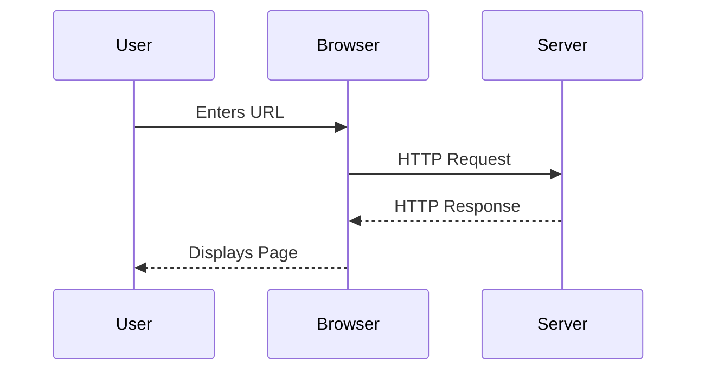

The `@docmd/plugin-mermaid` plugin integrates [Mermaid.js](external:https://mermaid.js.org/) into docmd. It renders plain-text diagram declarations into interactive SVG visuals with automatic theme matching, panning, and zooming capabilities.

## Configuration Options

Configure Mermaid rendering options in `docmd.config.json`:

| Option | Type | Default | Technical Description |
| :--- | :--- | :--- | :--- |
| `enabled` | `boolean` | `true` | Enable or disable Mermaid diagram rendering globally. |

### Global Configuration Example

```json "docmd.config.json"
{
  "plugins": {
    "mermaid": {
      "enabled": true
    }
  }
}
```

## Key Capabilities

* **Appearance Synchronization**: Diagram color schemes adapt dynamically to active light and dark appearance modes.
* **Interactive Canvas**: Built-in panning, zooming, and fullscreen expand triggers.
* **Lazy Initialisation**: Diagram rendering scripts load asynchronously only when the diagram intersects the viewport.
* **Icon Integration**: Supports `icon:name` syntax powered by Lucide icons within node definitions.

## Usage & Syntax

Write diagrams using fenced code blocks tagged with the `mermaid` language identifier.

### Sequence Diagram Example

::: tabs

== tab "Preview"


== tab "Source"
````markdown

````

:::

### Architecture Diagram Example

```mermaid
architecture-beta
    group api(icon:cloud)[API Service]
    service db(icon:database)[Database] in api
    service disk(icon:hard-drive)[Storage] in api
    db:L -- R:disk
```



::: callout tip "AI Knowledge Extraction" icon:cpu
Because Mermaid diagrams are authored in plain text within Markdown source files, AI agents and LLM scrapers ingest diagram structures directly without requiring OCR image processing.
:::