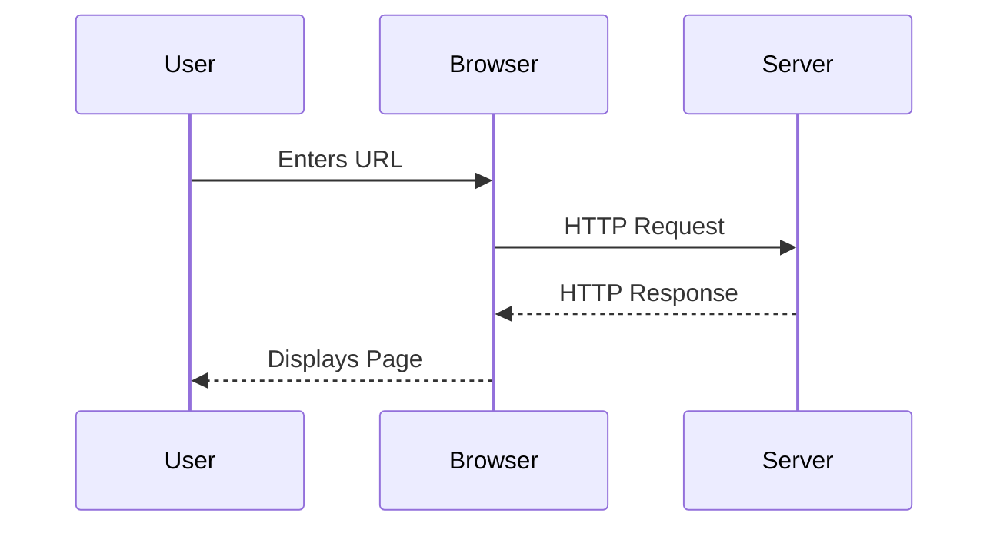

`@docmd/plugin-mermaid` 插件将 [Mermaid.js](external:https://mermaid.js.org/) 无缝集成至 docmd 中。它将纯文本图表声明渲染为带有自动主题匹配、平移和缩放功能的交互式 SVG 视觉图表。

## 配置选项

在 `docmd.config.json` 中配置 Mermaid 渲染选项：

| 选项 | 类型 | 默认值 | 技术描述 |
| :--- | :--- | :--- | :--- |
| `enabled` | `boolean` | `true` | 全局启用或禁用 Mermaid 图表渲染。 |

### 全局配置示例

```json "docmd.config.json"
{
  "plugins": {
    "mermaid": {
      "enabled": true
    }
  }
}
```

## 核心能力

* **外观同步**: 图表配色方案会根据当前的亮色或暗色外观模式进行动态适应。
* **交互式画布**: 内置平移、缩放与全屏展开控件。
* **惰性初始化**: 图表渲染脚本仅在图表进入视口时才会异步加载。
* **图标集成**: 支持在节点定义中使用由 Lucide 图标驱动的 `icon:name` 语法。

## 用法与语法

使用带有 `mermaid` 语言标识符的围栏代码块编写图表。

### 序列图示例

::: tabs

== tab "预览"


== tab "源码"
````markdown

````

:::

### 架构图示例

```mermaid
architecture-beta
    group api(icon:cloud)[API Service]
    service db(icon:database)[Database] in api
    service disk(icon:hard-drive)[Storage] in api
    db:L -- R:disk
```



::: callout tip "AI 知识提取" icon:cpu
由于 Mermaid 图表在 Markdown 源码文件中以纯文本撰写，AI 智能体与 LLM 抓取程序可直接读取图表结构，无需通过 OCR 图像识别处理。
:::