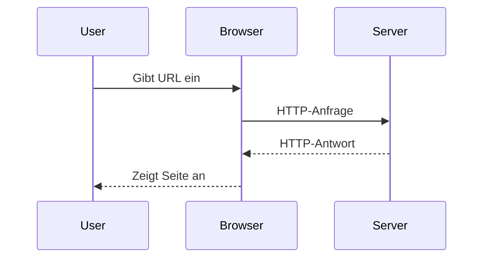
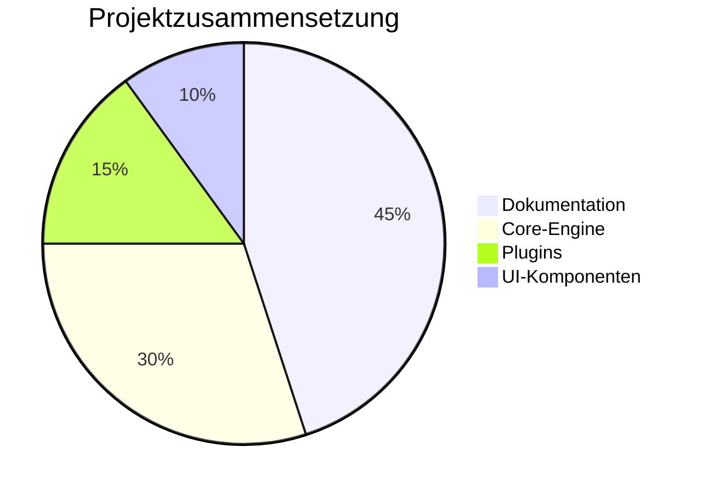
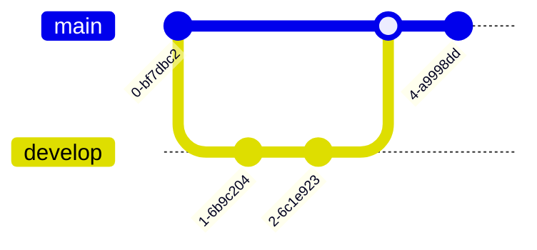
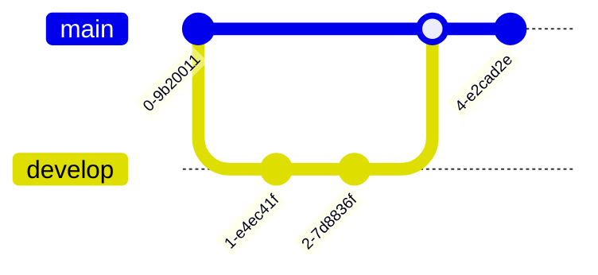
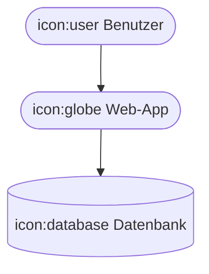

Das Plugin `@docmd/plugin-mermaid` integriert die leistungsstarke [Mermaid.js](https://mermaid.js.org/)-Engine in Ihre Dokumentations-Pipeline. Es ermöglicht Ihnen, Textbeschreibungen in hochwertige, interaktive Diagramme zu verwandeln, ohne Ihre Markdown-Umgebung verlassen zu müssen.

## Hauptmerkmale

- **Zero Scripting**: Manuelles Einbinden von externen Skripten oder CDN-Links ist nicht erforderlich. `docmd` erkennt die Verwendung und fügt die Rendering-Engine nur dort ein, wo sie benötigt wird.
- **Theme-Bewusstsein**: Diagramme passen ihre Farbschemata automatisch an den Wechsel zwischen **Hell-** und **Dunkelmodus** Ihrer Website an.
- **Isomorphes Lazy-Loading**: Für eine optimale Performance werden Diagramme erst initialisiert und gerendert, wenn sie in den Sichtbereich des Benutzers gelangen.
- **Interaktive Steuerung**: Jedes Diagramm verfügt über integrierte **Schwenk-**, **Zoom-** und **Vollbildfunktionen**, um sicherzustellen, dass große Architekturdiagramme auf allen Bildschirmgrößen lesbar bleiben.
- **Icon-Integration**: Tiefe Unterstützung für das **Lucide**-Icon-Paket, sodass Sie die `icon:name`-Syntax in Architekturdiagrammen verwenden können.
- **Technische Lesbarkeit**: Diagramme bleiben in Ihrer Quelle reiner Text, was sie leicht versionierbar und für KI-Agenten lesbar macht.

## Konfiguration

Um die Unterstützung für Diagramme zu aktivieren, fügen Sie das `mermaid`-Plugin zu Ihrer `docmd.config.js` hinzu:

```javascript
import { defineConfig } from '@docmd/core';

export default defineConfig({
  plugins: {
    mermaid: {} // Ohne Konfiguration aktiviert
  }
});
```

## Implementierungs-Galerie

Um ein Diagramm zu rendern, platzieren Sie Ihre Mermaid-Syntax in einen Code-Block mit der Sprachkennung `mermaid`.

### 1. Sequenzdiagramme
Ideal zur Veranschaulichung von Interaktionen zwischen mehreren Systemkomponenten.

::: tabs

== tab "Vorschau"


== tab "Markdown-Quelle"
````markdown

````

:::

### 2. Analytische Diagramme
Visualisieren Sie Daten mit integrierten Diagrammtypen wie Torten- oder Balkendiagrammen.

::: tabs

== tab "Vorschau"


== tab "Markdown-Quelle"
````markdown

````

:::

### 3. Git-Workflows
Visualisieren Sie Branching- und Merging-Strategien für Ihre Entwicklerhandbücher.

::: tabs

== tab "Vorschau"


== tab "Markdown-Quelle"
````markdown

````

:::

### 4. Architektur & Icons
Verwenden Sie das integrierte **Lucide**-Icon-Paket, um detailreiche Architekturdiagramme zu erstellen, die zum visuellen Stil Ihrer Website passen.

::: tabs

== tab "Vorschau"


== tab "Markdown-Quelle"
````markdown

````

:::

## Technische Umsetzung

Das Mermaid-Plugin fängt `mermaid`-Codeblöcke während der Parsing-Phase ab und hüllt sie in einen speziellen `<div class="mermaid">`-Container.

1. **Erkennung**: Die Engine durchsucht das gerenderte HTML nach dem Vorhandensein von Mermaid-Containern.
2. **Asset-Injektion**: Falls Container gefunden werden, fügt `docmd` ein leichtgewichtiges `init-mermaid.js`-Modul ein.
3. **Rendering**: Die Mermaid-Bibliothek wird asynchron geladen und rendert die Diagramme clientseitig. So bleibt Ihre initiale HTML-Last klein und schnell.

::: callout tip "Diagramme für KI-Agenten"
Während Diagramme für Menschen visuell hilfreich sind, sind sie für KI technisch transparent. Da die Quelle reiner Text ist, können Modelle wie GPT-4 oder Claude Ihre Systemarchitektur oder Logikflüsse durch den `llms-full.txt`-Stream „sehen“. Dies ermöglicht es der KI, komplexe architektonische Zusammenhänge basierend auf Ihren Diagrammen zu erklären.
:::