Die `docmd`-Version 0.7.4 führt eine leistungsstarke neue Funktion für unser Offline-Such-Plugin ein: **Kontextbezogene Versionsfilterung**. Außerdem enthält sie einen Hotfix für das Rendering von Mermaid-Icons und die Syntax-Standardisierung.

## ✨ Highlights

### 🔍 Versionsfilterung in der Suche

Beim Erstellen einer Dokumentation mit mehreren Versionen kann es schwierig sein, die richtigen Informationen zu finden. Das integrierte Such-Modal versteht nun nativ Versionssilos und generiert automatisch eine dynamische Filterleiste.

- **Intelligente Versionserkennung**: Die Suchmaschine extrahiert automatisch alle verfügbaren Versionen aus Ihrem Index und generiert klickbare Filter-Tags.
- **Farbcodierte Tags**: Jedem Versions-Tag wird automatisch eine einzigartige, ästhetisch ansprechende Farbe aus einer vordefinierten Palette zugewiesen, um Benutzern die visuelle Unterscheidung verschiedener Dokumentations-Silos zu erleichtern.
- **Echtzeit-Umschaltung**: Benutzer können auf Tags klicken, um ihre Suchergebnisse sofort auf eine oder mehrere spezifische Versionen einzugrenzen, was ein wesentlich saubereres und genaueres Sucherlebnis bietet.

### 🏷️ Inline-Tags-Container

Wir haben einen brandneuen `tag`-Container eingeführt! Dies ist eine selbstschließende Inline-Komponente, die dafür entwickelt wurde, pillenförmige Badges direkt in Ihren Text oder Ihre Überschriften einzufügen.

- **Vollständig anpassbar**: Überschreiben Sie Standardfarben mit einem beliebigen CSS-Farbstring (`color:#ef4444`).
- **Icon-Unterstützung**: Fügen Sie ganz einfach ein beliebiges Lucide-Icon (`icon:check-circle`) direkt zum Tag hinzu.
- **Hyperlinks**: Verwandeln Sie Tags nahtlos in Links, indem Sie das Attribut `link:` verwenden.
- **Überschriften-kompatibel**: Tags richten sich automatisch an der Grundlinie aus, ohne massive Schriftgrößen zu übernehmen, wenn sie in `<h1>`- oder `<h2>`-Elementen verwendet werden.

## 🐛 Fehlerbehebungen

- **Mermaid-Icon-Registrierung**: Ein Problem wurde behoben, bei dem das Lucide-Icon-Paket in Mermaid-Flussdiagrammen nicht ordnungsgemäß von der benutzerseitigen Syntax entkoppelt war.
- **Architektursyntax-Unterstützung**: Wir haben unsere dokumentierte Unterstützung für Mermaid-Icons offiziell auf die nativen Diagrammtypen `architecture` und `architecture-beta` von Mermaid umgestellt, welche eingebettete Iconify-Knoten perfekt unterstützen.

## ✨ Standardisierte Icon-Syntax

Um die zugrunde liegende Icon-Bibliothek (derzeit Lucide) aus Ihren Diagrammen zu abstrahieren, haben wir das Paket generisch als `icon` registriert.

Das bedeutet, dass Sie nun `icon:` anstelle einer expliziten Bindung Ihrer Dokumentation an `lucide:` verwenden sollten. Dies macht Ihre Diagramme zukunftssicher – sollten wir jemals die zugrunde liegende Icon-Bibliothek in `docmd` erweitern oder ändern, werden Ihre Diagramme diese Updates automatisch übernehmen, ohne dass Sie etwas ändern müssen!

**Beispiel:**

```mermaid
architecture-beta
    group api(icon:cloud)[API]
    service db(icon:database)[Database] in api
    service disk(icon:hard-drive)[Storage] in api
    db:L -- R:disk
```

## Migrationsleitfaden

Für **Endbenutzer**: Aktualisieren Sie auf den neuesten Patch mit `npm update @docmd/core`.

Wenn Sie zuvor `lucide:` in Ihren Mermaid-Diagrammen verwendet haben, ersetzen Sie dieses bitte durch das neue Präfix `icon:`.
