Die `docmd`-Version 0.7.4 ist ein Hotfix, der ein im vorherigen Release eingeführtes Problem beim Rendern von Mermaid-Icons behebt. Wir haben das Icon-Auflösungssystem vollständig standardisiert, um es zukunftssicher und eng mit unserer nativen `docmd`-Syntax zu verzahnen.

## 🐛 Fehlerbehebungen

- **Mermaid-Icon-Registrierung**: Ein Problem wurde behoben, bei dem das Lucide-Icon-Paket in Mermaid-Flussdiagrammen nicht ordnungsgemäß von der benutzerseitigen Syntax entkoppelt war.
- **Architektursyntax-Unterstützung**: Wir haben unsere dokumentierte Unterstützung für Mermaid-Icons offiziell auf die nativen Diagrammtypen `architecture` und `architecture-beta` von Mermaid umgestellt, welche eingebettete Iconify-Knoten perfekt unterstützen.

## ✨ Standardisierte Icon-Syntax

Um die zugrunde liegende Icon-Bibliothek (derzeit Lucide) aus Ihren Diagrammen zu abstrahieren, haben wir das Paket generisch als `icon` registriert.

Das bedeutet, dass Sie nun `icon:` anstelle einer expliziten Bindung Ihrer Dokumentation an `lucide:` verwenden sollten. Dies macht Ihre Diagramme zukunftssicher – sollten wir jemals die zugrunde liegende Icon-Bibliothek in `docmd` erweitern oder ändern, werden Ihre Diagramme diese Updates automatisch übernehmen, ohne dass Sie etwas ändern müssen!

**Beispiel:**

```mermaid
architecture-beta
    group api(icon:cloud)[API]
    service db(icon:database)[Database] in api
    service disk(icon:hard-drive)[Storage] in api
    db:L -- R:disk
```

## Migrationsleitfaden

Für **Endbenutzer**: Aktualisieren Sie auf den neuesten Patch mit `npm update @docmd/core`.

Wenn Sie zuvor `lucide:` in Ihren Mermaid-Diagrammen verwendet haben, ersetzen Sie dieses bitte durch das neue Präfix `icon:`.
