The `docmd` 0.7.4 release is a hotfix that addresses a rendering issue with Mermaid icons that was introduced in the previous release. We have completely standardized the icon resolution system to be future-proof and tightly coupled with our native `docmd` syntax.

## 🐛 Bug Fixes

- **Mermaid Icon Registration**: Fixed an issue where the Lucide icon pack was not properly decoupled from the user-facing syntax in Mermaid flowcharts.
- **Architecture Syntax Support**: We have officially migrated our documented Mermaid icon support to use Mermaid's native `architecture` and `architecture-beta` diagram types, which support inline Iconify nodes perfectly.

## ✨ Standardized Icon Syntax

To abstract the underlying icon library (currently Lucide) from your diagrams, we have registered the pack generically as `icon`.

This means that instead of explicitly tying your documentation to `lucide:`, you should now use `icon:`. This future-proofs your diagrams—if we ever expand or change the underlying icon library in `docmd`, your diagrams will automatically inherit the updates without any changes required on your end!

**Example:**

```mermaid
architecture-beta
    group api(icon:cloud)[API]
    service db(icon:database)[Database] in api
    service disk(icon:hard-drive)[Storage] in api
    db:L -- R:disk
```

## Migration Guide

For **end users**: Update to the latest patch with `npm update @docmd/core`. 

If you previously used `lucide:` in your Mermaid diagrams, please replace it with the new `icon:` prefix.
