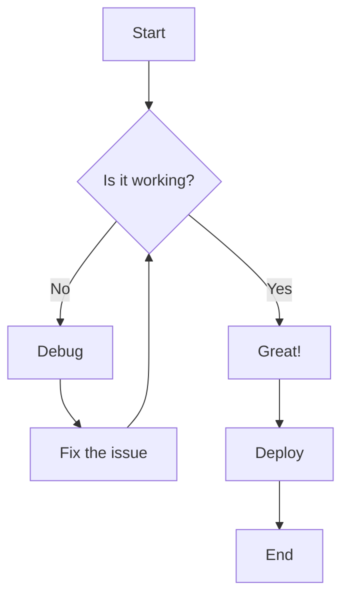

```text
   _                 _ 
 _| |___ ___ _____ _| |
| . | . |  _|     | . |
|___|___|___|_|_|_|___|
```

**Generate beautiful, lightweight documentation sites directly from your Markdown files. Zero clutter, just content.**

`docmd` bridges the gap between simple static site generators and heavy, framework-driven applications. It processes standard Markdown into highly optimized static HTML, while delivering a buttery-smooth Single Page Application (SPA) experience for your users.

::: button "Get Started" /getting-started/installation
::: button "View on GitHub" external:https://github.com/docmd-io/docmd color:#333

## Quick Start

You can have a beautiful documentation site running locally in under a minute. Requires [Node.js](https://nodejs.org/) installed on your machine.

```bash
# 1. Install docmd globally
npm install -g @docmd/core

# 2. Initialize a new project in your current directory
docmd init

# 3. Start the local development server
docmd dev
```

Open `http://localhost:3000` in your browser. Any changes you make to the files in the `docs/` folder will instantly update on your screen.

## Why choose docmd?

We believe writing documentation should be as frictionless as possible. You shouldn't need to configure complex JavaScript frameworks just to publish text.

<div class="image-gallery" style="grid-template-columns: repeat(auto-fit, minmax(300px, 1fr));">
    
::: card Seamless SPA Navigation
We generate static HTML for ultimate SEO and fast initial loads, but once the page is open, `docmd` intercepts navigation to swap content instantly without ever reloading the browser.
:::

::: card Zero Configuration
Run `docmd init` and start writing. Our sensible defaults mean you don't have to touch a configuration file unless you want to customize your branding or layout.
:::

::: card Smart Offline Search
Built-in full-text search with fuzzy matching and keyword highlighting. It runs entirely in the browser using a generated index, meaning it works perfectly even on air-gapped networks.
:::

::: card Isomorphic Engine
`docmd` isn't just a CLI. The exact same rendering engine can run natively inside a web browser, allowing you to embed live documentation previews directly into your own web apps.
:::

</div>

## Rich Content Out of the Box

Write naturally. `docmd` extends standard Markdown with intuitive, nestable components to help you structure complex information beautifully.

::: tabs

== tab "Containers"
Easily highlight information using Callouts.

::: callout tip Pro Tip
You can nest containers inside each other infinitely. Try putting a button inside a card inside a tab!
:::

== tab "Diagrams"
Native support for **Mermaid.js**. Just create a code block with the `mermaid` language tag, and it automatically renders and adapts to your user's Light/Dark mode preference.



== tab "Code"
Automatic syntax highlighting powered by `highlight.js`, complete with one-click copy buttons and themes tailored for optimal contrast.

:::

Ready to dive in? Check out the [Basic Usage](/getting-started/basic-usage) guide or explore how to [Configure](/configuration/) your site.