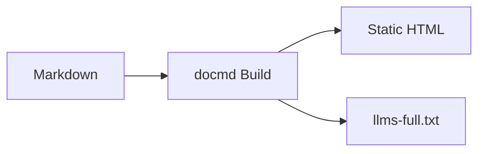

```text
   _                 _ 
 _| |___ ___ _____ _| |
| . | . |  _|     | . |
|___|___|___|_|_|_|___|
```

**Generate professional, high-performance documentation sites directly from Markdown. Zero clutter, just content.**

`docmd` bridges the gap between simple static site generators and heavy, framework-driven documentation tools. It transforms standard Markdown into highly optimized static HTML while delivering a seamless Single Page Application (SPA) experience.

::: button "Get Started" /getting-started/installation
::: button "GitHub" external:https://github.com/docmd-io/docmd color:#333
::: button "Explore Features" /getting-started/basic-usage color:#333

## Quick Start

**Requires [Node.js](https://nodejs.org/) (v18 or higher) installed.**

Deploy a beautiful, searchable documentation site in seconds. No framework knowledge or complex setup required.

**1. Install `docmd` as a development dependency**
```bash
npm install -D @docmd/core     # Recommended: Install locally
npx docmd init                 # Initialize your project configuration
npx docmd dev                  # Start the development server
```

**2. Global Installation (Optional)**
```bash
npm install -g @docmd/core     # Run docmd from anywhere on your system
```

**3. Instant Zero-Config Execution**
```bash
# Start a dev server instantly without any local configuration
npx docmd dev -z
```

Once running, open `http://localhost:3000` in your browser. Changes to your files in the `docs/` folder will reflect instantly via Hot Module Replacement (HMR).

## Why choose docmd?

Writing documentation should be frictionless. You shouldn't have to manage complex JavaScript frameworks or deep configuration trees just to publish technical text. `docmd` is built for **both humans and AI**, serving as the most LLM-friendly static site generator available.

<div class="image-gallery" style="grid-template-columns: repeat(auto-fit, minmax(300px, 1fr));">

::: card "AI-Native Optimization"
`docmd` generates a structured context for LLMs (`llms.txt` and `llms-full.txt`), allowing AI models to ingest your entire project context perfectly in a single request.
:::

::: card "Zero Config & Auto-Routing"
Executing `docmd dev -z` automatically scans for documentation directories, extracts headings as page titles, and builds a nested, collapsible navigation tree instantly.
:::

::: card "SPA Performance"
We serve pre-rendered HTML for maximum SEO and initial load speed. Once loaded, `docmd` transitions between pages as a high-performance SPA, ensuring instant content swaps without full browser reloads.
:::

::: card "Smart Offline Search"
Features built-in full-text search with fuzzy matching and deep linking. The search index runs entirely in-browser, making it fully functional in offline or air-gapped environments.
:::

::: card "Modern & Responsive"
Designed for all devices. Includes premium themes with native Light/Dark appearance modes, sticky versioning, and mobile-optimized sidebars out of the box.
:::

::: card "Isomorphic Rendering"
The same engine used for static builds can run natively in the browser. Embed live documentation previews or interactive editors directly into your own web applications.
:::

</div>

## Rich Content Out of the Box

`docmd` extends standard Markdown with intuitive components designed for professional documentation structures.

::: tabs

== tab "Interactive Components"
Highlight critical information with Callouts and native Buttons.

::: callout tip Performance Tip
Nest containers inside each other to create complex layouts without touching HTML or CSS.
:::

::: button "Read about Containers" /content/containers/callouts

== tab "Native Diagrams"
Create professional architectural diagrams using **Mermaid.js** syntax directly in your Markdown files.


```mermaid
graph LR
    MD[Markdown] --> Build[docmd Build]
    Build --> Static[Static HTML]
    Build --> LLM[llms-full.txt]
```

== tab "Code Precision"
Automatic syntax highlighting with `highlight.js`, including one-click copy buttons and multi-language support.

```javascript
// docmd.config.js
import { defineConfig } from '@docmd/core';

export default defineConfig({
  title: 'My Project',
  layout: { spa: true }
});
```

:::

Ready to build? [Install docmd](./getting-started/installation.md) or see [Zero-Config Mode](./getting-started/zero-config.md) in action.