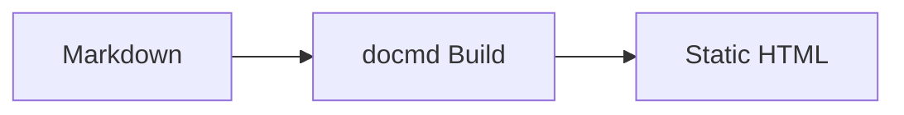

::: hero

# docmd

A zero-configuration documentation generator that transforms Markdown files into interactive documentation.

::: button "Quick Start" /getting-started/quick-start
::: button "GitHub" external:https://github.com/docmd-io/docmd color:#333
:::

<!-- IMAGE NEEDED: High-quality screenshot of a complete docmd documentation site showing sidebar, content, and search. -->

## Core capabilities

::: grids
::: grid
::: card "Zero Config"
Run in any folder with `.md` files. Navigation, structure, and sidebars are generated automatically.
:::
:::
::: grid
::: card "AI-Native"
Generates `llms.txt` and full context dumps automatically, allowing AI agents to read your documentation perfectly.
:::
:::
::: grid
::: card "Static & SPA"
Serves static HTML for optimal SEO, then transitions smoothly between pages as a high-performance SPA.
:::
:::
::: grid
::: card "Built-in Search"
Features full-text search with fuzzy matching and deep linking, running entirely in the browser.
:::
:::
::: grid
::: card "Native Themes"
Includes clean themes with system-aware light and dark modes, sticky versioning, and mobile layouts.
:::
:::
::: grid
::: card "Isomorphic"
The same engine builds static sites and powers live browser editors. Embed previews directly in your app.
:::
:::
:::

## Rich content support

docmd extends standard Markdown with built-in containers for complex, engaging layouts.

::: tabs

== tab "Containers"
Build interactive UI without writing HTML. Use tabs, steps, and cards.

::: grids
::: grid
::: card "Grids and Cards"
Organise features natively without touching CSS.
:::
:::
::: grid
::: card "Callouts"
Highlight important context and warnings.
:::
:::
:::

== tab "Mermaid Diagrams"
Create architectural diagrams directly in your content.


```mermaid
graph LR
    MD[Markdown] --> Build[docmd Build]
    Build --> Static[Static HTML]
```

== tab "Code Blocks"
Automatic syntax highlighting with copy buttons and multi-language support.

```javascript
import { defineConfig } from '@docmd/core';

export default defineConfig({
  title: 'My Project'
});
```

:::

## Next steps

::: grids
::: grid
::: card "Quick Start"
[Launch a site](./getting-started/quick-start.md) in under 60 seconds.
:::
:::
::: grid
::: card "Installation"
[Install locally](./getting-started/installation.md) or globally.
:::
:::
:::