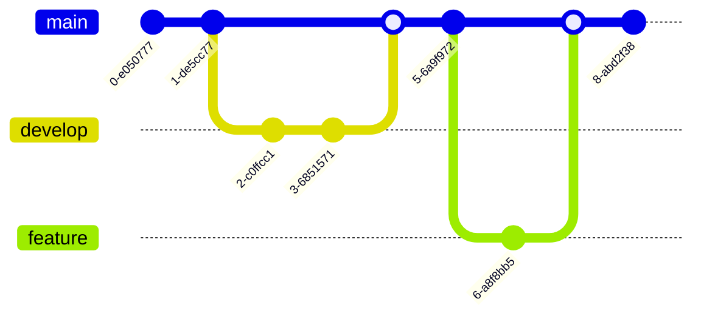

# Mermaid Diagrams

Mermaid is a JavaScript-based diagramming and charting tool that uses Markdown-inspired text definitions to create and modify diagrams dynamically. docmd has built-in support for Mermaid diagrams with automatic light/dark theme switching.

::: callout tip
All Mermaid diagrams automatically adapt to your site's light/dark theme!
:::

## Flowchart

Flowcharts are used to represent workflows or processes. They show the steps as boxes of various kinds, and their order by connecting them with arrows.

**Code:**

````markdown

````

**Rendered Preview:**


## Sequence Diagram

Sequence diagrams show how processes operate with one another and in what order. They capture the interaction between objects in the context of a collaboration.

**Code:**

````markdown

````

**Rendered Preview:**


## Pie Chart

Pie charts are circular statistical graphics divided into slices to illustrate numerical proportions.

**Code:**

````markdown

````

**Rendered Preview:**


## Git Graph

Git graphs visualize Git branching and merging operations, making it easier to understand version control workflows.

**Code:**

````markdown

````

**Rendered Preview:**


## XY Chart

XY charts display data as a series of points on a coordinate plane, useful for showing correlations and trends.

**Code:**

````markdown

````

**Rendered Preview:**


## Best Practices

When using Mermaid diagrams in your documentation:

1. **Keep it Simple**: Start with simple diagrams and add complexity only when needed
2. **Use Clear Labels**: Make sure all nodes and connections are clearly labeled
3. **Consider Your Audience**: Adjust the level of detail based on who will read the documentation
4. **Test Both Themes**: Always check how your diagrams look in both light and dark modes
5. **Add Context**: Use callouts or text around diagrams to explain what they represent

::: callout info
Visit the [Official Mermaid Documentation](https://mermaid.js.org/) for more types of Mermaid Diagrams and, detailed syntax and options.
:::

