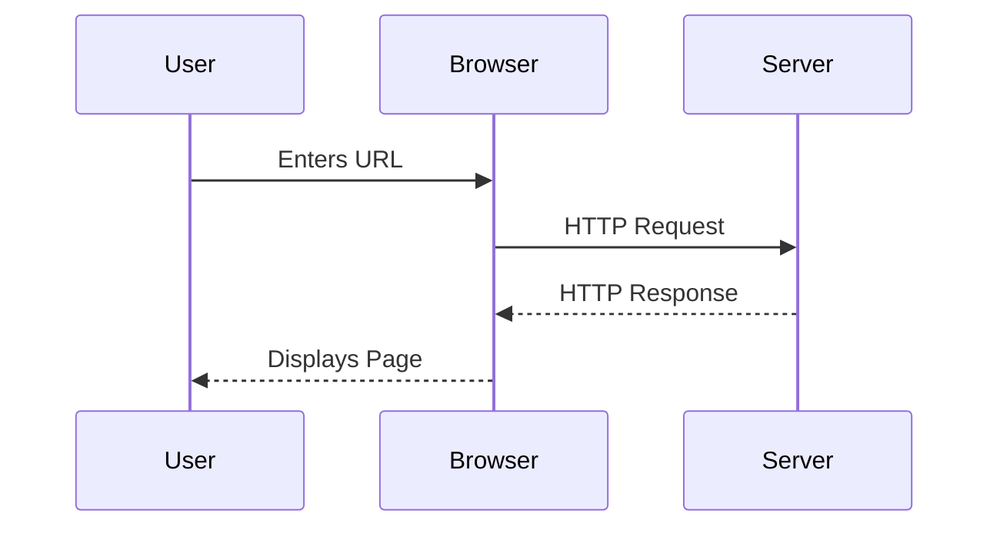
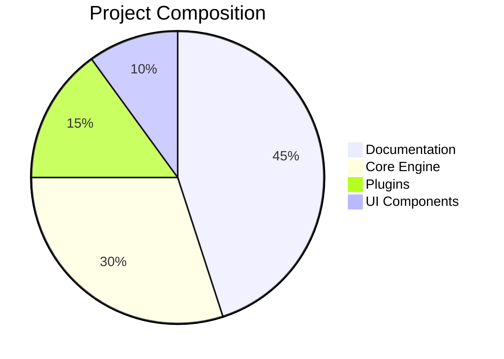
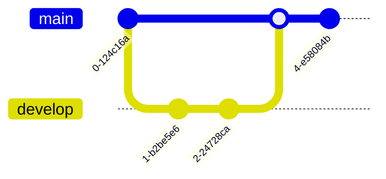
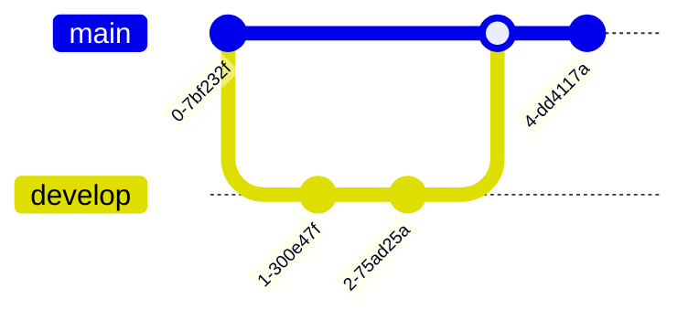
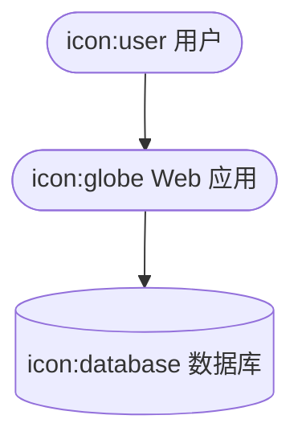

`@docmd/plugin-mermaid` 插件将强大的 [Mermaid.js](https://mermaid.js.org/) 引擎集成到你的文档流水线中。它允许你将纯文本描述转化为高保真、交互式图表，无需离开 Markdown 环境。

## 主要特性

- **无需编写脚本**：无需手动引入外部脚本或 CDN 链接。`docmd` 自动检测使用情况，仅在需要时注入渲染引擎。
- **主题感知**：图表会自动适应其配色方案，以匹配你站点的**浅色**或**深色**模式切换。
- **同构懒加载**：为优化性能，图表仅在进入用户视口时才初始化和渲染。
- **交互式控制**：每个图表都内置了**平移**、**缩放**和**全屏**功能，确保大型架构图在各种屏幕尺寸上都清晰可见。
- **图标集成**：深度支持 **Lucide** 图标库，允许你在架构图中使用 `icon:name` 语法。
- **技术可读性**：图表在源文件中保持纯文本格式，便于版本控制，AI Agent 也可轻松读取。

## 配置

在 `docmd.config.js` 中添加 `mermaid` 插件以启用图表支持：

```javascript
import { defineConfig } from '@docmd/core';

export default defineConfig({
  plugins: {
    mermaid: {} // 零配置启用
  }
});
```

## 示例画廊

将 Mermaid 语法放在带 `mermaid` 语言标识符的代码块中即可渲染图表。

### 1. 序列图
非常适合说明多个系统组件之间的交互。

::: tabs

== tab "预览"


== tab "Markdown 源码"
````markdown

````

:::

### 2. 分析图表
使用饼图或条形图等内置图表类型可视化数据。

::: tabs

== tab "预览"


== tab "Markdown 源码"
````markdown

````

:::

### 3. Git 工作流
为你的开发者指南可视化分支和合并策略。

::: tabs

== tab "预览"


== tab "Markdown 源码"
````markdown

````

:::

### 4. 架构与图标
使用集成的 **Lucide** 图标库创建与站点视觉风格一致的丰富架构图。

::: tabs

== tab "预览"


== tab "Markdown 源码"
````markdown

````

:::

## 技术实现

Mermaid 插件在解析阶段拦截 `mermaid` 代码块，并将其包装在专用的 `<div class="mermaid">` 容器中。

1. **检测**：引擎扫描渲染后的 HTML，查找 mermaid 容器的存在。
2. **资源注入**：如果存在容器，`docmd` 注入轻量级的 `init-mermaid.js` 模块。
3. **渲染**：Mermaid 库异步加载并在客户端渲染图表，确保初始 HTML 负载保持小巧快速。

::: callout tip "为 AI Agent 提供图表"
虽然图表对人类非常直观，但对 AI 来说在技术层面是透明的。由于源码是纯文本，GPT-4 或 Claude 等模型可以通过 `llms-full.txt` 流"看到"你的系统架构或逻辑流程。这使 AI 能够基于你的图表解释复杂的架构关系。
:::