`docmd` 0.7.4 版本是一个热修复，解决了上一版本中引入的 Mermaid 图标渲染问题。我们已经完全标准化了图标解析系统，以确保其面向未来，并与我们原生的 `docmd` 语法紧密结合。

## 🐛 问题修复

- **Mermaid 图标注册**：修复了在 Mermaid 流程图中，Lucide 图标库未能与用户使用的语法正确解耦的问题。
- **架构图语法支持**：我们已正式将 Mermaid 图标支持的文档迁移至使用 Mermaid 原生的 `architecture` 和 `architecture-beta` 图表类型，这些类型原生完美支持内联 Iconify 图标节点。

## ✨ 标准化的图标语法

为了在图表中抽象底层的图标库（目前为 Lucide），我们将图标包统一注册为 `icon`。

这意味着，您现在应该使用 `icon:` 而不是将文档显式绑定到 `lucide:`。这能为您的图表提供面向未来的保障——如果我们将来在 `docmd` 中扩展或更改了底层图标库，您的图表将自动继承这些更新，而无需您进行任何修改！

**示例：**

```mermaid
architecture-beta
    group api(icon:cloud)[API]
    service db(icon:database)[Database] in api
    service disk(icon:hard-drive)[Storage] in api
    db:L -- R:disk
```

## 迁移指南

对于**最终用户**：使用 `npm update @docmd/core` 更新到最新的补丁版本。

如果您之前在 Mermaid 图表中使用了 `lucide:`，请将其替换为新的 `icon:` 前缀。
